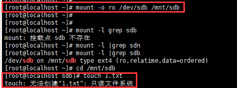
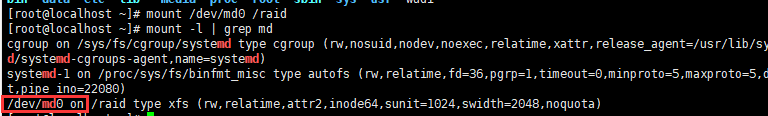

# linux7月学习实践

### Linux软连接实践学习

软连接在linux里面意思就等于是Windows是快捷方式

ln-s 目标绝对路径 > 快捷方式绝对路径

ln -s ./wudi/jiege2.txt /root/ruanlianjie

通过命令创建以后显示目录 证明软件链接创建成功

### 文件系统的格式化及挂载实践学习

linux系统文件格式有

ext2

ext3 centos5

ext4 centos6

1xfs centos7   命令MKFS代表可以把我的分区转换成下面这些不同的文件系统

fsck命令 修复文件系统的命令

如果这边尾数为1的话 这边代表开机不自行挂载检测,我这边3个都是0 说明开机是不会进行自检的

lsblk命令 列出所有的设备以及文件系统信息

lsblk -l 发现从虚拟机上新添加的2g大小 sdb盘

2.对新的磁盘进行分区 输入fdisk /dev/sdb

输入n选择一个添加分区,然后 p选择主分区, 分区号默认1 剩下的进行默认设置

输入mkfs.ext4 /dev/sdb 将sdb磁盘进行分区格式化,并将磁盘进行挂载 输出lsblk-l 查看挂载成功

3.文件的挂载可以设置成只读系统, mount -o ro /磁盘目录 /到指定目录

在设置成只读系统后,将无法在文件里进行创建

### Swap交换分区实践学习

swap是linux磁盘管理的特殊分区,当实际内存不足的时候,操作系统会从整个内存中取出一部分给系统使用

使用swap分区作用是,通过系统调取,程序可以用到的实际内存 远大于物理内存

free-m 查看当前系统使用的内存情况

### buff和cached解析以及创建swap分区学习

buffers 缓冲区 给数据加速使用

cached 缓存 读取速度加速使用

创建swap分区 内存分配<2G 分配和内存大小同样空间 >2g也就分配2g空间

当电脑在休眠时候,内存中数据会放入SWAP分区中,当电脑恢复以后,再从SWAP读取数据恢复正常工作

1.需要先给磁盘进行分区 通过fdisk -l | grep sd 查看目前所有的磁盘

2.针对磁盘分区进行格式化

fdisk /dev/sdb 选择 print the partition table 打印分区表进行确认,

再选择add a new partition 添加新的分区

最后选择change a partition's system id 更改分区ID&#x20;

输入命令P 打印确认 确认无误后选择w命令进行保存

3.查看之前的swap内存 只有2047

4.swapon /dev/sdb1 激活交换空间以后 使用free -m查看swap交换分区更改为2547

也可以使用swapoff /deb/sdb1 关闭交换分区

## 内存释放学习

1.free -m显示有多余内存 但是linux提示内存不足

方案1.echo 1 >  /proc/sys/vm/drop\_caches 手动清理缓存

方案2. echo 2 > /proc/sys/vm/drop\_caches 清理目录缓存和inodes

2.清理文件系统缓存 使用sync命令,用于清理僵尸进程,可以将缓存中的数据 先写入到磁盘

## 开机自动挂载文件学习

mount命令是临时生效的,下次重启会就会失效,导致挂载的分区无法使用

/etc/fstab ,存放静态文件的地方,系统重启的时候 每次都会读取这个文件信息,可以进行自动挂载

用vim /etc/fstab 打开后如下

/dev/sdb     /mnt/sdb     xfs     defaults    0 0 解析语句

第一列:/dev/sdb是设备名字,可以是文件系统,和设备名字,NFS远程网络文件系统

第二列:/mnt/sdb 是挂载点 将前面的文件 挂载到/mnt/sdb 目录下面

第三列:xfs 文件格式

第四列:defaults 是挂载默认方式

第五列:0  不对挂载点进行备份,默认都是0

第六列:0 fsck磁盘检测 默认是0 表示开机不对磁盘进行检测

然后输入mount -a检查挂载的时候发现报错,有查阅资料后发现2处错误, 第一处是在sdc目录下进行删除挂载导致无法正常进行,返回至根目录就接触,第二个问题是ext4格式问题,后面对新做的sdc硬盘进行删除sdc1分区,然后输入mkfs.xfs -f /dev/sdc1 进行文件系统格式化

最后验证mount -a 无报错 reboot重启系统 打印cat  /etc/fstab&#x20;

## 报告文件系统磁盘使用情况

\[root\@localhost /]# df -T -h&#x20;

df是显示磁盘空间使用情况 -T属性代表文件类型 -h以容易阅读的方式显示

du -ah —max-depth=2 /opt 代表统计opt目录下 2层文件夹的大小

du-ah —exclude=' \*.pyc' /opt/ 显示当前目录下所有文件 除了.pyc文件的大小,参数作用指定排除文件名

## RAID技术了解学习

Raid技术就是将多个独立的硬盘,组成更强大的磁盘阵列组

raid-0: 读、写性能提升，无容错能力，空间n\*min(s1,s2…)，最少磁盘数2个

raid-1: 又称为镜像存储，写性能略有下降，读性能提升，有容错，空间：1\*min(s1,s2…)，最少磁盘数2个，允许坏一个磁盘

raid-4: 读、写性能提升，有容错能力（最多坏一块磁盘），空间：(n-1)\*min(s1,s2…)，最少磁盘数3个，第三个放校验码

raid-5: 读、写性能提升，有容错能力（最多坏一块磁盘），利用奇偶校验，空间：(n-1)\*min(s1,s2…)，最少磁盘数3个

raid-6: 有两块校验盘，容许同时坏两块，至少需要4块盘，空间：(n-2)\*min(s1,s2…)

raid-10: 读、写性能提升，有容错能力（每一组镜像可坏一块盘），空间：n\*min(s1,s2…)/2，最少磁盘数4个

raid目前常见组合主要用 raid01 raid5+10 用于服务器上

不同场景,选择不同的raid, 单台服务器,数据很重要 磁盘不多 可以用raid1组合

用作数据库的服务器 可以用raid1+0组合

没有重要数据的话 可以用raid0组合

## 部署raid10学习

1.因为raid10需要用到 4块硬盘 这边在虚拟机中重新添加了3块硬盘

2.因为格式的问题,我直接将sdb-sde 全部重新做了格式化 mkfs.ext4的系统格式做raid10

mdadm -Cv  /dev/md0  -a yes -n 4 -l 10  /dev/sdb /dev/sdc /dev/sdd  /dev/sde

\-C 表示创建RAID阵列

\-v 表示创建过程

/dev/md0 表示raid阵列名字

\-a yes 自动创建阵列设备文件

\-n4(指定磁盘数量)&#x20;

\-l 10(指定raid等级) &#x20;

/dev/sdb /dev/sdc /dev/sdd  /dev/sde(要组成raid的硬盘)

3.组合好的硬盘 需要进行文件系统的格式化mkfs.xfs /dev/md0 选择centos7的xfs系统

4.对磁盘进行挂载

新建一个空文件夹用于阵列分区进行挂载

mkdir /raid

mount /dev/md0 /raid

mount -l | grep md 发现已成功挂载

5.检查raid10 详细信息

mdadm -D /dev/md0

6.写入数据检测磁盘是否正常,检查使用空间

\[root\@localhost raid]# echo {1..1000000} > ceshi.txt&#x20;

\[root\@localhost raid]# vim /etc/fstab 修改文件 将md0写入开入自动挂载中

/dev/md0  /raid/ xfs  defaults 0 0

## raid10故障修复学习

raid10恢复实践,先假设sdb硬盘有问题 移除sdb

mdadm /dev/md0 -f /dev/sdb

输入mdadm -D /dev/md0 提示sdb有错误&#x20;

这边查看文件 显示都在 证明挂了一块硬盘 不影响使用,也可以写入新的文件

对于换的硬盘 可以进行模拟更换

先直接重启 清除failed devices,然后卸载挂载 umount /dev/sd0

重新添加一块硬盘做raid10&#x20;

mdadm /dev/md0 -a /dev/sdb

最后验证mdadm -D /dev/md0

1.raid10重启需要创建配置文件&#x20;

\[root\@localhost \~]# echo DEVICE /dev/md0 > /etc/mdadm.conf

\[root\@localhost \~]# mdadm -Ds >> /etc/mdadm.conf

2.取消raid1挂载,停止raid

\[root\@localhost \~]# umount /dev/md0

\[root\@localhost raid]# mdadm -S /dev/md0

然后重新加入一个以前定义的RAID

\[root\@localhost raid]# mdadm -A /dev/md0
mdadm: /dev/md0 has been started with 4 drives.

正常查看raid10信息 硬盘激活4个

## raid的卸载学习

1.先卸载挂载

\[root\@localhost \~]# umount /dev/md0

2.停止raid服务

\[root\@localhost \~]# mdadm -S /dev/md0
&#x20;  mdadm: stopped /dev/md0

3.卸载raid中的磁盘

\[root\@localhost \~]# mdadm --misc --zero-superblock /dev/sdb

\[root\@localhost \~]# mdadm --misc --zero-superblock /dev/sdc

\[root\@localhost \~]# mdadm --misc --zero-superblock /dev/sdd

\[root\@localhost \~]# mdadm --misc --zero-superblock /dev/sde

4.删除raid配置文件

5.删除/etc/fstab中的挂载命令

\[root\@localhost \~]# vim /etc/fstab

清除 /dev/md0 /raid xfs defaults 0 0

## raid与备份盘的学习

3块盘搭建raid5 1块当备用盘

mdadm -Cv /dev/md5 -n 3 -l 5 -x 1 /dev/sd\[b-e]

\-C创建一个raid组

v 显示创建过程

/dev/md5 创建的目录

\-n 3 表示3块硬盘 -l 5表示 raid组5 -x 1 表示备份

/dev/sd\[b-e] 表示要组的硬盘组

创建完以后进行验证raid组 mdadm -D /dev/md5

3块使用用 1块备份 对硬盘组进行格式化 mkfs.xfs -f /dev/md5

然后对磁盘组进行挂载 mount /dev/md5 /raid5&#x20;

输入mount -l | grep md 检测是否成功挂载

写入数据检测raid 能否正常使用df -Ht | grep md5

模拟硬盘挂掉的情况

\[root\@localhost \~]# mdadm /dev/md5 -f /dev/sdb 移除sdb硬盘

\[root\@localhost \~]# mdadm -D /dev/md5 查看磁盘raid详细信息,发现故障sdb已被移除sde已激活

查看raid5里面文件全都存在 无丢失

\[root\@localhost \~]# ls /raid5
raid55.txt  raid5.test

## lvm原理学习

lvm=逻辑卷技术,是讲一个或者多个硬盘在逻辑上进行合并,当你某个硬盘空间不够的时候,会从其他空闲硬盘拿来容量进行使用

lvm创建流程

1.物理分区阶段,针对物理磁盘进行分区fdisk格式化 修改系统ID 默认是83,改为8e类型,8e是lvm类型

2.通过PVcreate ,PVdisplay将linux分区改成物理卷

3.通过VGcreate  VGdisplay 将创建好的物理卷PV改成卷组VG

4.创建LV 将卷组分为逻辑卷

1.创建LVM命令笔记

\[root\@localhost \~]# pvcreate /dev/sdb /dev/sdc

在创建的时候发现失败 提示

&#x20;   Device /dev/sdb excluded by a filter.

这边网上查找资料是需要

重建分区和再次创建卷的时候擦除签名信息

parted /dev/sdb/sdc 对sdb 和sdc分别擦除

(parted) mklabel msdos
警告: The existing disk label on /dev/sdb will be destroyed and all data on this disk will be lost. Do you want to
continue?

是/Yes/否/No? yes                                                        &#x20;
(parted) quit                                                            &#x20;
信息: You may need to update /etc/fstab.

2.最后重新创建物理卷

\[root\@localhost \~]# pvcreate /dev/sdb /dev/sdc

3.创建卷组提示成功

\[root\@localhost \~]# vgcreate juanzu666 /dev/sdb /dev/sdc

Volume group "juanzu666" successfully created

4.检查是否存在卷组

\[root\@localhost \~]# pvscan

5.尝试扩容卷组

\[root\@localhost \~]# vgextend juanzu666 /dev/sdd 3个硬盘总共6G 扩展成功

6.缩小卷组 剔除 /dev/sdc

\[root\@localhost \~]# vgreduce juanzu666 /dev/sdc

Removed "/dev/sdc" from volume group "juanzu666"

7.删除物理卷

提示删除成功

8.在已有的卷组中创建一个逻辑卷

\[root\@localhost \~]# lvcreate -n juanzu -L +500M juanzu666

lvcreate -n 指定名字 juanzu

\-L 指定容量大小+500M 从juanzu666里扣

9.对逻辑卷进行格式化 mkfs.xfs /dev/juanzu666/juanzu

10.对卷组进行挂载使用

11.写入数据并检测

12.修改etc/fstab 开机进行自动挂载

\[root\@localhost \~]# vim /etc/fstab

最后一行写入 /dev/juanzu666/juanzu /testjuanzu xfs defaults 0 0

mount -a 进行验证 无报错说明开机自动挂载成功

df-a&#x20;

## linux 进程管理命令

ps用于报告当前系统进程状态的命令,和kill配合使用的多

查看某一个进程是否占用了大量内存,资源 是否确定关闭他

PID 代表唯一ID

TTY 代表控制台号码

TIME 代表进程所使用CPU的总时间

CMD代表正在执行的系统命令行是什么

ps-ef

\-e显示系统所有运行的进程

\-f 显示ID PID PPID C STIME TTY TIME CMD等信息

不同用户在编辑文件的时候 可以用ps-ef清楚的看到

ps -aux&#x20;

显示当前终端下所有进程,包括其他用户的进程信息

参数解析

user 进程属于哪个用户

PID 进程ID豪

%cpu CPU情况

%men 内存情况

VSZ 表示该进程所占用的内存量

TTY 这个进程所在终端信息

START 表示进程状态

S:终端睡眠,可以被唤醒

s这个进程包含子进程

R这个进程运行中

D这个进程不可终端睡眠

T表示进程停止

Z表示僵尸进程,父进程崩溃

\+前台进程

< 优先级高的进程

N 优先级较低的进程

L 有些页被锁进内存；

TIME 进程运行的时间

CMD 进程执行的命令

ps -u "用户名"

可以查看指定用户的进程选项

显示进程树的信息,ps-eH 显示父进程,子进程的命令

第一层sshd 父亲进程

sshd登陆了机器

第二层子进程

远程链接后 启动bash进程

第三层子进程

切换用户

第四层进入su子进程

\-l 列出所有的参数

常用的kill参数

1\) SIGHUP 挂起进程,终端突然掉线,用户突然退出

2\) SIGINT 中断信号,一般常用 Ctrl+c 发送信号2

3\) SIGQUIT 退出信号,一般常用Ctrl+\ 发出信号3

9\) SIGKILL 强制中断信号,一般用于立即杀死某程序

15\) SIGTERM kill默认使用的就是 15信号 终止进程

20\) SIGTSTP 暂停进程 组合键Ctrl+Z 发出暂停

终止进程

可以看到chen用户在编辑test.txt文件

用命令选择唯一UID

\[root\@localhost \~]# kill 12568

在chen用户命令端这边发现进程已被关闭

## TOP资源管理器学习

top命令用于实时的监控系统的处理器状态,以及其他硬件的负载信息还有动态的进程信息

第一版本系统的负载信息

top - 13:24:25 up 10:34,  3 users 代表当前的机器时间

10.34代表系统运行了多久

3 users 当前机器 几个用于在用

load average: 0.00, 0.01, 0.05

显示系统的平均负载情况 值越小 负载越低

Tasks: 132 total,   2 running, 130 sleeping,   0 stopped,   0 zombie

总共进程任务的情况

TOP 第二版块 动态的进程信息

user 执行进程的用户

PR 进程的优先级

NI NICE值 越高代表优先级越高

VIRT 进程虚拟内存总量

RES 进程物理内存大小

SHR 共享内存大小

S表示状态

top实际使用命令介绍

top命令下 按1 表示查看linux的逻辑CPU个数

大写M代表按内存大小进行排序

top -c

显示文件的绝对路径

## nohub介绍学习

其功能是用于后端运行程序。nohup命令可以将程序以忽略挂起信号的方式运行起来，而被运行程序的输出信息不会显示到屏幕上

\[root\@localhost \~]# nohup ping baidu.com
nohup: 忽略输入并把输出追加到"nohup.out"

在根目录下输入 tail -f nohub.out 实时更新数据

\[root\@localhost \~]# ps -ef | grep nohup
root      16759  16417  0 14:49 pts/1    00:00:00 grep --color=auto nohup
\[root\@localhost \~]# ps -ef | grep ping
root      15584  13813  0 14:32 pts/0    00:00:00 ping baidu.com
root      16777  16417  0 14:50 pts/1    00:00:00 grep --color=auto ping

使用grep过滤能看到后台正在此程序

## HTOP、GLANCES学习

HTOP命令就是更高级更好看的一个TOP命令升级版，可设置的TOP命令

功能更多更全面 可以在进程中直接搜索对应的进程，查看层级关系（父进程、子进程） 杀死相关进程。

GLANCES

能将采集到的数据，输出一个文件中，便于数据分析，对服务器性能报表进行分析绘图

yum install glances -y

glances 管理界面

输入h进入帮助界面命令

a – 对进程自动排序
c – 按 CPU 百分比对进程排序
m – 按内存百分比对进程排序
p – 按进程名字母顺序对进程排序
i – 按读写频率（I/O）对进程排序
d – 显示/隐藏磁盘 I/O 统计信息
f – 显示/隐藏文件系统统计信息
n – 显示/隐藏网络接口统计信息
s – 显示/隐藏传感器统计信息
y – 显示/隐藏硬盘温度统计信息
l – 显示/隐藏日志（log）
b – 切换网络 I/O 单位（Bytes/bits）
w – 删除警告日志
x – 删除警告和严重日志
1 – 切换全局 CPU 使用情况和每个 CPU 的使用情况
h – 显示/隐藏这个帮助画面
t – 以组合形式浏览网络 I/O
u – 以累计形式浏览网络 I/O
q – 退出（‘ESC‘ 和 ‘Ctrl\&C‘ 也可以）

## 网络学习

osi七层模型&#x20;

物理、数据链路、网络、传输、会话、表示、应用

## ifconfig命令

用于配置网卡ip地址信息,等网络参数信息

或者查看显示网络接口信息,类似Windows的ipconfig命令

网卡的启动/关闭

ifconfig ens33 up/down

修改设置IP地址

ifconfig ens33:0 192.168.232.159 netmask 255.255.255.0 up

修改本机mac地址信息

ether 00:0c:29:d9:46:6a

ifconfig ens33 hw ether 00:0c:29:d9:30:2a

修改完毕以后需要重启网卡

ifconfig ens33/down /up

ifconfig命令都是临时的,如果要永久修改 需要去\[root\@localhost etc]# cd /etc/sysconfig/network-scripts/

进入network目录下以后 vim ifcfg-ens33修改,这是DHCP自动获取的配置

如果需要变成静态IP的话 需要将bootproto=dhcp 修改成static 添加静态IP地址、子网掩码、网关、dns,然后重新加载配置文件,让网卡进行生效 \[root\@localhost \~]# systemctl restart network.service

IPADDR=192.168.182.100   // static静态ip地址
NETMASK=255.255.255.0    // 子网掩码（固定一致即可）
GATEWAY=192.168.182.2    // 网关，与虚拟机VMnet8中设置的网关一致即可
DNS1=114.114.114.114     // dns地址解析（固定一致即可）重启

## route路由命令学习

查看路由表信息

\[root\@localhost \~]# route
Kernel IP routing table
Destination     Gateway         Genmask         Flags Metric Ref    Use Iface
default             gateway         0.0.0.0            UG    100    0        0 ens33
192.168.122.0   0.0.0.0         255.255.255.0   U     0      0        0 virbr0
192.168.232.0   0.0.0.0         255.255.255.0   U     100    0        0 ens33

添加一条指定的路由

\[root\@localhost \~]# route add -net 192.168.10.0 netmask 255.255.255.0 dev ens160

如果需要删除的话 把add 替换成del 代表删除指定路由

添加一条默认网关

\[root\@localhost \~]# route add default gw 192.168.10.1

## ip命令学习

\[root\@localhost \~]# ip addr show 显示各个接口和网络的设备的地址

\[root\@localhost \~]# ip link show dev ens33指定网络设备显示信息

关闭、激活网络设备

\[root\@localhost \~]# ip link set ens33 down/up

ip命令添加,删除ip信息

\[root\@localhost \~]# ip address add 192.168.232.119/24 dev ens33&#x20;

\[root\@localhost \~]# ip address del 192.168.232.119/24 dev ens33

使用ip命令 检查arp缓存 检查mac地址信息

\[root\@localhost \~]# arp -n
Address                  HWtype  HWaddress           Flags Mask            Iface
192.168.232.1            ether   00:50:56:c0:00:08   C                     ens33
192.168.232.2            ether   00:50:56:e8:86:d6   C                     ens33

## netstat 命令学习

显示网络连接情况,路由表信息,端口状态,网络连接情况

\[root\@localhost \~]# netstat -an
Active Internet connections (servers and established)
Proto Recv-Q   Send-Q      Local Address           Foreign Address         State     &#x20;
tcp              0       0                0.0.0.0:111             0.0.0.0:\*               LISTEN    &#x20;
tcp              0       0                192.168.122.1:53        0.0.0.0:\*               LISTEN    &#x20;
tcp              0       0                0.0.0.0:22              0.0.0.0:\*               LISTEN    &#x20;

proto 套接字使用的协议是什么

recv-Q 连接这个套接字的用户,还未拷贝的字节数

send-Q 远程主机还未确认的字节数

local address套接字本地的地址和端口号

forign address套接字远程的地址和端口号

state 监听状态

常用参数组合

netstat -tunlp  查看机器上正在运行的所有端口情况以及他的进程

\-t显示出TCP的连接情况

\-u显示出udp桥接情况

\-n不进行dns解析

\-l显示正在监听的情况

\-p 显示出套接字所属的进程和进程名情况&#x20;

## ping命令学习

ping用来检测主机之间能否通信,也可以用这个命令当做检测本机是否能够DNS解析

ping还可以用于检测主机网络状态

检测本机是否能够进行DNS解析

\[root\@localhost \~]# ping pythona1v.com
ping: pythona1v.com: 未知的名称或服务

出现这种情况 可能是机器无法上网了,也可能是无法进行dns域名解析

验证linux dns 配置文件vim /etc/resolv.conf

确保有正常的nameserver&#x20;

## telnet命令学习

\[root\@localhost \~]# telnet 192.168.232.156 22
Trying 192.168.232.156...
Connected to 192.168.232.156.
Escape character is '^]'.
SSH-2.0-OpenSSH\_7.4

正确打开了22端口的情况

\[root\@localhost \~]# telnet 192.168.232.156 24
Trying 192.168.232.156...
telnet: connect to address 192.168.232.156: Connection refused

说明远程机器24端口没有打开 或者拒绝连接的情况

常用端口

端口：22服务：SSH协议端口号

端口：23服务：Telnet协议端口号

端口：80服务：HTTP

端口：443服务：Https

端口：3306服务：MySQL

端口：3389服务：超级终端

wget命令

wget 用于下载指定的url资源文件

wget非常稳定支持断电续传 即使网络出现问题 也会不断进行尝试

\[root\@localhost tmp]# wget <https://wx1.sinaimg.cn/mw690/0026YIXUgy1h4cnfez3hnj60ck0ns41a02.jpg>

\[root\@localhost \~]# wget -O /tmp/test2.jpg <https://wx2.sinaimg.cn/mw690/0024jgTtly1h4de5e8rj7j60wi1eotsk02.jpg>

代表将指定文件 更名为test2.jpg并保存到tmp/文件夹中

\[root\@localhost \~]# wget --limit-rate=300k <https://www.linuxprobe.com/docs/LinuxProbe.pdf>

下载指定网络问题 限速最高300k

\[root\@linuxcool \~]# wget -c <https://www.linuxprobe.com/docs/LinuxProbe.pdf>

启用断点续传技术下载指定的网络文件,当下载任务断开以后,再次敲打命令 可实现续传功能

## grep练习题

1.找出有关root的行

grep 'root' /etc/passwd

2.找出root开头的行

grep ^root' /etc/passwd

匹配root开头或者开头的行

grep -E "^(root|chen)" /etc/passwd

过滤bin开头的行 ,并显示行号

&#x20;grep -E ^bin /etc/passwd -n

过滤出除了root开头的行

grep -v ^root /etc/passwd

统计root出现的次数

grep -c '^root' /etc/passwd

显示/etc/passwd文件中不以bin/bash结尾的行

grep -v '(bin/bash)\$' /etc/passwd

找出 jiege.txt文件中 所有大小写i开头的行

grep -i '^i' wudi/jiege.txt

找出系统上root chen nobody开头的用户

grep -E '^\\<(root|chen|nobody)\\>' /etc/passwd

## sed练习题

root替换一次和全部替换

sed 's/root/Root/' pwd2.txt

sed 's/root/Root/g'  pwd2.txt

替换文件中root为chen 且仅仅打印替换的效果

sed 's/root/chen/gp'  pwd2.txt -n

替换前10行bin开头的用户, 改为C&#x20;

sed -n '1,10 s/^bin/C/p' pwd2.txt

替换前10行b开头用户 改为C 将m改成M

sed -n -e '1,10 s/^b/c/ p' -e '1,10 s/^m/M/ p' pwd2.txt

删除4行后面所有

sed '4,\$d'  pwd2.txt

删除从root开始到ftp之间的行

sed '/^root/,/^ftp/d' pwd2.txt

将文件开头空白字符开头的行 添加注释

sed -e  's/^\[\[:space:]]/#/p' -e s/^\$/#/ lover.txt

删除文件的空白和注释行

sed '/^\$/d;/^#/d' lover.txt

给文件前三行 添加#符号

sed '1,3 s/\\(^.\\)/#\1/g' lover.txt

sed 取出ip地址

\[root\@localhost \~]# ifconfig ens33 | sed -n '2'p | sed 's/^.*inet//' | sed 's/netmask.*\$//'

ifconfig ens33 | sed '2s/^.*inet//;s/netmask.*//p' -n

dev硬盘文件

lib系统库文件

sbin 特权级二进制文件

var经常变化的文件 比如log日志

etc存放配置文件目录

boot存放内核和启动文件
