# shell学习心得

shebang指的是出现在文本文件的第一行前两个字符

\#!/bin/sh 通过sh去执行&#x20;

\#!/usr/bin/python 通过Python去执行

\#1/usr/bin/env 在不同平台上都能正确找到解释器的办法

在未指定解释器的时候 会默认使用sh解释器去执行文件

\#代表1个注释符 在#后的文件不生效

新建的shell 文件需要用chmod 赋予执行权限 不然无法执行

如果觉得权限过于高的话 尽量选择chmod + x&#x20;

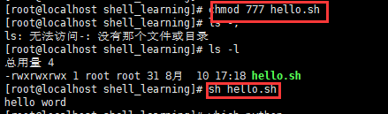

## 变量理解学习

变量是暂时存储数据的地方,是一种数据标记,通过调用正确的变量名字,可取出对应的值,字符串的变量 需要加引号

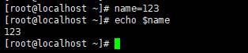

变量名规则 不可使用保留关键字,不能以数字开头 不能用标点符号

变量名区分大小写

> 📌单引号变量,不识别特殊语法 双引号变量,能识别特殊符号

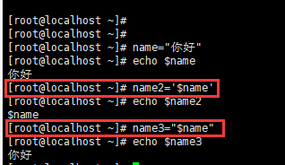

shell的特殊变量,用在脚本,函数传递参数使用

用不同的方式,执行脚本,产生的后果也不一样

source和. 是在当前的shell环境中加载变量,执行脚本

bash或sh 是在子shell运行的,变量也在子shell中加载运行

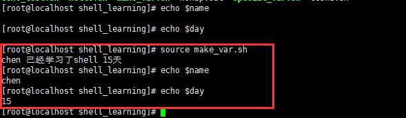

\$0 ———- 当前脚本的文件名（不带路经，带扩展名 .sh ）

\$n ———- 获取shell脚本的第n个参数 n在1-9之间,如\$1,\$2,\$9大于9则需要写

\$# ———- 统计传入的变量个数 &#x20;

\$\* ———- 列出所有参数 。” \$\* ” 整体列出

\$@———- 列出所有参数 ,加了引号以后 接收所有参数为独立字符串

参数的理解

bash test1.sh 参数1 参数2 参数3

实践脚本

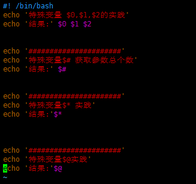

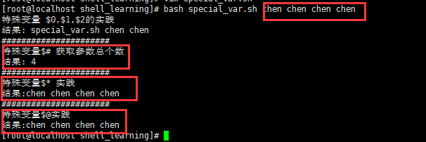

特殊状态变量

\$?———- 上一次命令执行状态返回值,0正确 非0失败

\$\$———- 当前shell脚本的进程号

\$!———- 上一次后台进程的ID


只有执行正确命令的时候 \$?返回正常值0 反之为0

脚本返回值,执行完以后,会返回数字ID 称之为返回值

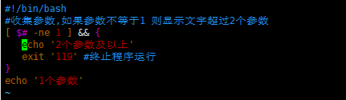

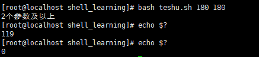

\$!返回上次后台进程的ID&#x20;

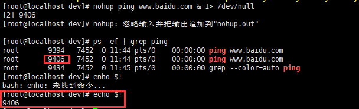

### 内置命令、外置命令学习,以及其他学习

内置命令:在系统启动时加载内存、常驻内存、执行率高，占用资源

外置命令:用户需要从硬盘中读取的文件,再进行加载

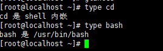

cd就是shell内嵌 就是内置命令

外置命令也可以算是 单独下载的文件系统命令,例如tree,nginx,tomcat

可以通过linux的type的命令,验证是否是内置,或外置命令

同时shell支持执行多行命令

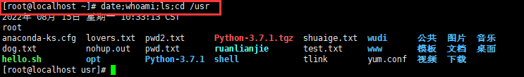

echo命令,可以在linux下进行格式化打印

\#!/bin/bash

\#这里用于显示日期,和谁登陆
echo "当前系统时间是"
date

echo "谁登陆了系统"
whoami
\~

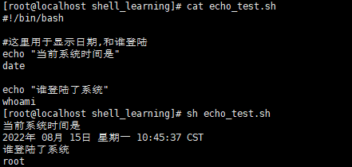

## shell的数学运算和双小括号

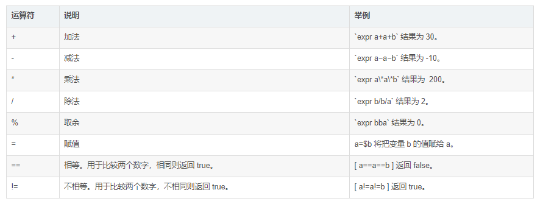

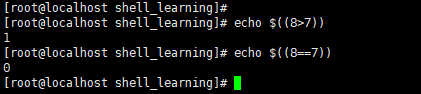

关于shell逻辑运算 返回1或0的值

实践双小括号用法,加减乘除

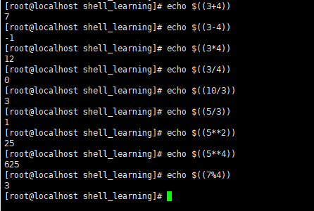

加减乘除和取余

综合变量的计算

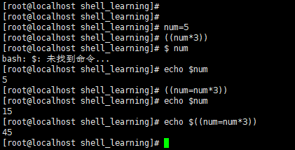

特殊符号运算

\++ 加一

&#x20;\- -减一

\++a 先计算+1 然后再赋值给变量a

a++先对变量a操作 然后再加1

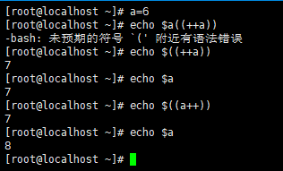

### shell脚本实践

函数的作用,就是把你写的功能代码,进行打包,封装成函数,方便调用执行

根据输入的数字进行计算

```bash
#!/bin/bash

#脚本实践

#函数的作用,就是把你写的功能代码,进行打包,封装成函数,方便调用执行
print_usage(){
        printf "请输入一个整数\n"

        exit 1
}
#接受用户输入的命令 -p参数后面写给用户看到的提示信息
#read -p "提示信息" 接受用户输入的变量
read -p "请输入数字"    firstnum

#使用if进行逻辑判断
#限制用户输入纯数字
if [ -n "`echo $firstnum|sed 's/[0-9]//g'`" ]
   then
        print_usage
fi

#再对运算符进行输入
read -p "请输入运算符" operrator

#在对运算符进行判断
#限制在 + - * / 四个符号

if [ "${operrator}" != "+" ] && [ "${operrator}" != "-" ] && [ "${operrator}" != "*" ] && [ "${operrator}" != "/" ]
   then
        echo"只允许输入+ - * /"
        exit 2
fi

#对第二个输入的数字 进行判断
read -p "请输入数字" secondnum
if [ -n "`echo $secondnum|sed 's/[0-9]//g'`" ]
   then
        print_usage
fi

#数值计算
echo "${firstnum}${operrator}${secondnum}结果是 $((${firstnum}${operrator}${secondnum}))"

```

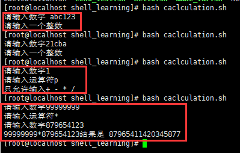

最终运行效果 正常判断数字 判断运算符 过滤字母 给出提示

### 使用脚本判断nginx是否存活

```bash
#!/bin/bash


checkurl(){

   timeout=5
   #相当于定义一个计数器
   fails=0
   success=0


   #循环检测
   while true
        do
           wget --timeout=${timeout} --tries=1 http://192.168.70.17/ -q -O /dev/null
           #echo $?
           # if条件参数 -ne 代表不等于
           if [ $? -ne 0  ]
                then
                   let fails=fails+1 #代表失败次数加1
           else
                   let success+=1 #代表成功次数加1
           fi

           #判断当成功次数大于等于1的时候,可以得出该网站是正常的
           # -ge 是大于等于的意思
           if [ $success -ge 1 ]
                then
                echo "网站正常运行"
                #返回状态码0
                exit 0
           fi


           #当错误次数>2时候 告警 发邮件等
           if [ ${fails} -ge 2 ];then

              echo "网站一定挂了"
              exit 2
           fi
done
}
checkurl


```

然后把这个脚本添加到定时任务里面

crontab -e&#x20;

\*\*\*      /usr/shell\_learning/check\_nginx.sh

代表每分钟进行命令执行

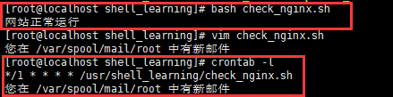

直接运行 提示网站正常

定时任务里面 每分钟定期发送到root里面

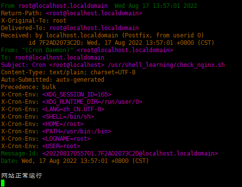

### expr命令

必须通过空格传递参数 可进行计算,也可以进行逻辑判断

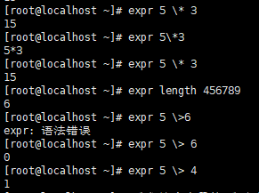

正确返回1 错误返回0

还可以进行模式匹配,冒号代表统计字符串,.\*代表任意的字符串重复0次或者多次


通过expr命令判断文件名后缀是否合法

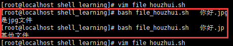

```bash
#!/bin/bash
#判断来自第一个参数以后 统计字符并匹配后缀名
if expr "$1" ":" ".*\.jpg" &> /dev/null
        then
        echo "是jpg文件"
else
        echo "其他文件"
fi

```

找出长度不大于6的单词

```bash
#!/bin/bash
#通过for循环 先显示变量这些词组
for  str1 in i am student, i like learn linux
        do
#进行逻辑判断 如果变量str1 字符串长度 >6 (ge 在if判断里代表> lt代表<)
        if [ `expr length $str1`  -ge 6  ]
 
          then
          #输出变量str1
                 echo $str1
fi
done

```

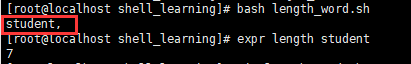

运行结果 直接显示最长的字符串

### bc命令 – 数字计算器

Bash解释器仅能够进行整数计算，而不支持浮点运算，因此有时要用到bc命令进行高精度的数字计算工作

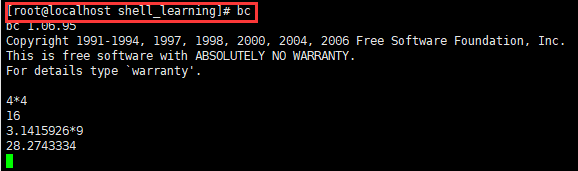

在BC状态下面可以进行 高精度计算

也可以配合管道符 进行多重计算

计算1-1000所有数字加起来的总和

\[root\@localhost shell\_learning]# echo {1..1000} | tr ' ' + | bc
500500

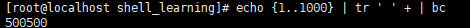

### shell条件测试

通过test命令 检查条件是否成立

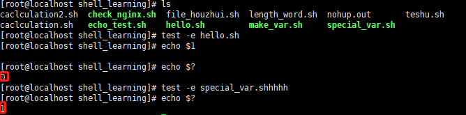

正确返回0 错误返回1 可以判断是否存在这个文件

test 也可以用于文件的权限侦测和两个文件之间进行比较

执行条件表达式并显示返回值。&#x20;

```bash
[root@pc root]$ test ! "abc" == 123; echo ?
 0 
# 等价形式
[root@pc root] [ ! "abc" == 123 ]; echo ?
 0 
 [root@pc root] [[ ! "abc" == 123 ]]; echo $? 
 0

```

\-f 判断文件是否是普通文件类型是个话返回TRUE 不是的话 返回FALSE

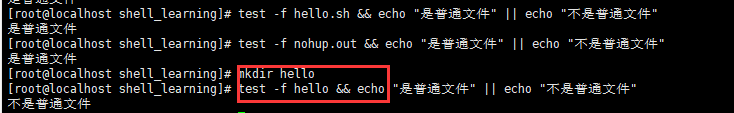

\-d 判断是否是目录类型 是个话返回TRUE 不是的话 返回FALSE

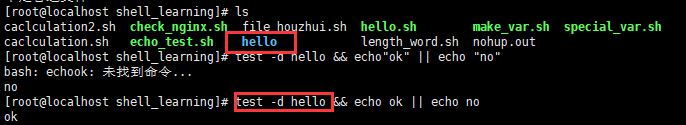

\-z 字符串为空,则为TRUE

\-n字符串不为空 则为TRUE

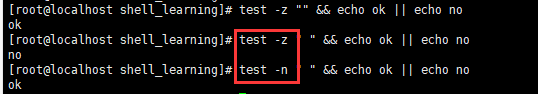

### &#x20;中括号条件测试\[ ]

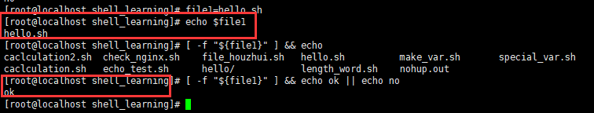

通过定义变量file1 返回测试正确值 ok

双中括号验证文件是否有写入权限

\[chen\@localhost shell\_learning]\$ \[ -r "大碗宽面.txt" ] && cat 大碗宽面.txt || echo "你没权限 看个锤子"

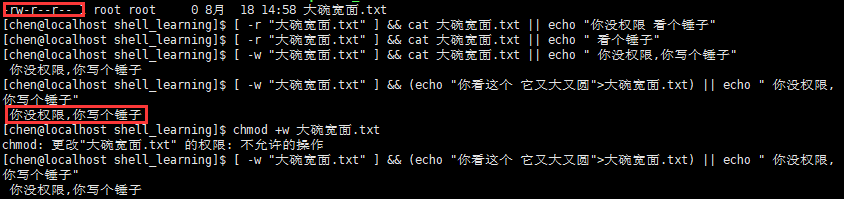

```bash
[root@localhost shell_learning]# chmod a+w 大碗宽面.txt 
-rw-rw-rw- 1 root root     0 8月  18 15:44 大碗宽面.txt
```

通过root chmod更改其他用户组 写入权限以后 可以正常写入并输出

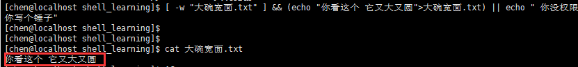

字符串的逻辑判断

&#x20;!= 不等于

\= 等于

! 取反

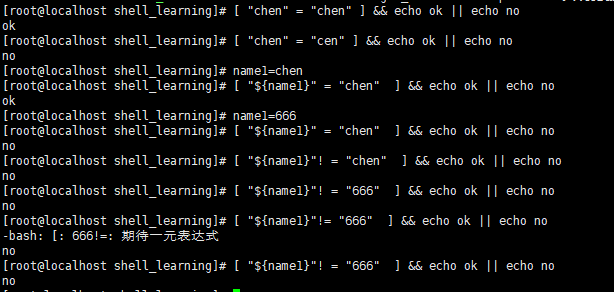

### 数值比较测试


在中括号中,使用数学比较符号,请添加转义符号

`\>` 再不添加转义符的情况下 会出现执行错误混乱的一个情况


逻辑运算的脚本学习

接受用户输入,判断它是否等于某个数字

```bash
#!/bin/bash

read -p "请输入一个字符" var1

#逻辑条件测试
 [  "$var1" -eq "1" ] && {
  echo $var1
  exit 0
}

#如果变量 =2 然后输出变量
 [  "$var1" = "2"  ] && {
  echo $var1
  exit  0
}

#除了1,2以外的数字 其他报错

[ "$var1" != "2" -a "$var1" != "1"  ] && {
   echo "只能输入数字1或者2"
  exit 2
}
~           
```

执行效果正常 输入1和2以外的数字 直接过滤出现提示

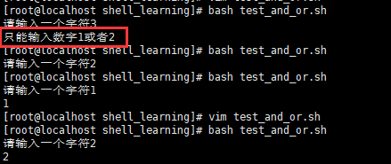

模拟安装逻辑脚本实践

根据要求输入指令 进行相对应的指令逻辑判断

```bash
#!/bin/bash

path=/usr/shell_learning/test_scripts

#判断路径 如果没有 按path变量 进行创建
[ ! -d "$path" ]&& mkdir $path -p
#打印end之间的内容
cat << end
   1. [install lamp]
   2. [install lnmp]
   3. [exit]
   "请选择对应数字执行"
end

read num

expr $num+1 &> /dev/null

[ $? -ne 0 ] && {

 echo "请输入1,2,3之内的选项"
 exit 1
}

#对输入的数字1,2,3进行判断
[ "$num" -eq "1" ] && {

 echo "正在安装lamp中"
 sleep 2;

 # 对文件权限进行判断
 [ -x "$path/lamp.sh" ] || {
 echo "没有该文件的执行权限,请联系管理员"
 exit 2
}
 $path/lamp.sh
 exit $?
}


# 判断选择2的情况,安装lnmp

[ "$num" -eq "2" ] && {
  echo "正在安装lnmp"
  sleep 2;

# 对文件执行权限判断

 [ -x "$path/lnmp.sh"  ] || {
 echo "没有该文件的执行权限,请联系管理员"
 exit 2
}
 $path/lamp.sh
 exit $?
}
# 退出

[ "$num" -eq 3 ] && {
  echo "退出"
  exit 3
}
#判断数字编号
 [[ ! "$sum" =~ [1-3] ]] && {
  echo "请输入指定数字"
  exit 4
}

                           

```

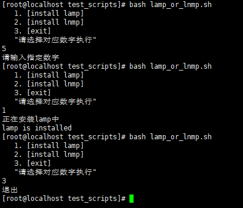

执行效果 能正常根据数据要求进行逻辑判断 安装以及退出

if语句学习,

if <条件表达式>

&#x20;   then

&#x20;   代码....

if

&#x20;   then

&#x20;   代码....

fi

fi

if  <条件表达式>

&#x20;   then

&#x20;      当条件成立 ,进行执行

else

&#x20;  否则执行这个

fi

### if实践

可以用if语句代替部分正则表达式

```bash
#!/bin/bash

if  [ -f /etc/hosts ]
        then
        echo "[  ] it is ok"

fi

if  [[ -f /etc/hosts ]] ; then
        echo "[[]] it is ok"

fi

if  test -f /etc/hosts ; then
        echo "test it is ok"
fi

```

通过if判断参数大小

```bash
#!/bin/bash

a=$1
b=$2

if [ "$a" -lt "$b" ];then
        echo "yes, $a 小于 $b "
        exit 0
fi

if [ "$a" -eq "$b" ];then
        echo "yes, $a 等于 $b "
        exit 0
fi

if [ "$a" -gt "$b" ];then
        echo "yes, $a 大于 $b"
        exit 0
fi
~   
输出的结果是
[root@localhost test_scripts]# bash read_if.sh 5 4
yes, 5 大于 4
[root@localhost test_scripts]# bash read_if.sh 5 5
yes, 5 等于 5 
[root@localhost test_scripts]# bash read_if.sh 4 5
yes, 4 小于 5 


```

上面是单分支的IF脚本语句  可以通过多分支进行简化

```bash
#!/bin/bash

a=$1
b=$2

if [ "$1" -le "$2"  ]; then
        echo "是的,$1 小于 $2" 

elif [ "$1" -eq "$2"  ]; then
        echo "是的,$1 等于 $2"

elif [ "$1" -gt "$2" ]; then
        echo "是的,$1 大于 $2"

fi
~   
输出的结果
[root@localhost test_scripts]# bash read_if2.sh 5 6
是的,5 小于 6
[root@localhost test_scripts]# bash read_if2.sh 4 3
是的,4 大于 3
[root@localhost test_scripts]# bash read_if2.sh 3 3
是的,3 小于 3


```

### linux检测内存实践

检测linux 剩余内存,当内存小于100m 发邮件给运维

并且将脚本设置为3分钟执行一次,自动检测内存

思路:

1.获取内存情况

2.配置邮件告警,发送告警邮件

3.判断剩余内存,是否需要发送邮件

4.加入crontab 3分钟执行一次

```bash
#!/bin/bash
#定义一个变量free_memory 获取 freem-m 内存的最后一行
free_memory=`free -m |awk 'NR==2 {print $NF}'`
#定义chars变量 并输出free_memory
chars="现在的内存是 $free_memory"
#进行判断 如果当前变量内存 小于 2100
if [ "$free_memory" -lt "2100"  ]
        then      #输出当前内存到messages.txt中
                echo $chars|tee /tmp/messages.txt
        #邮件 主题,收件人,内容 
        mail -s "`date +%F-%T`$chars" 200921743@qq.com < /tmp/messages.txt
        echo "内存不足,抓紧维护"

fi

[root@localhost test_scripts]# bash memonry_if.sh 
现在的内存是 493
内存不足,抓紧维护

并且加入计时任务
[root@localhost test_scripts]# crontab  -l
*/3 * * * * /usr/shell_learning/test_scripts/memonry_if.sh  &>/usr/shell_learning/memory_test.txt


每隔3分钟执行一次,并且将日志 输出到memory_test.txt里面

编辑自动发送邮件的文档

vi /etc/mail.rc

添加如下信息

# For Linux and BSD, this should be set.

set bsdcompat

set from=200921743@qq.com smtp=smtp.qq.com

set smtp-auth-user=alvin smtp-auth-password=123456 smtp-auth=login

#注意：200921743@qq.com是邮箱账号，alvin 是我的邮箱用户名，123456 是邮箱密码
```


学习 Python和php连接mysql

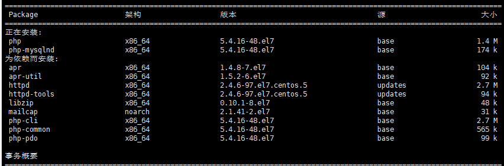

先通过yum install php-mysqlnd php 安装相关环境依赖

在安装好依赖环境以后 开始制作conn进行连接

```bash
<?php
$mysql_id=mysql_connect("localhost","root","123456") or mysql_error();
if ($mysql_id){
    echo "mysql连接成功\n";
} else{
 echo mysql_error();
}
当运行脚本的时候 发生如下错误
[root@localhost test_scripts]# php mysql_php.php 
PHP Warning:  mysql_connect(): The server requested authentication method unknown to the client [caching_sha2_password] in /usr/shell_learning/test_scripts/mysql_php.php on line 2
PHP Warning:  mysql_connect(): The server requested authentication method umknown to the client in /usr/shell_learning/test_scripts/mysql_php.php on line 2

后面查证mysql8默认的使用密码认证方式不一样，mysql8.0默认使用caching_sha2_password，但是之前版本都是使用mysql_native_password

解决方案：
将密码认证方式caching_sha2_password修改为mysql_native_password
mysql> select host,user,plugin from user;
+-----------+------------------+-----------------------+
| host      | user             | plugin                |
+-----------+------------------+-----------------------+
| localhost | mysql.infoschema | caching_sha2_password |
| localhost | mysql.session    | caching_sha2_password |
| localhost | mysql.sys        | caching_sha2_password |
| localhost | root             | mysql_native_password |
+-----------+------------------+-----------------------+

[root@localhost test_scripts]# php mysql_php.php 
mysql连接成功
重新运行脚本 提示连接成功

```

python连接数据库

安装对应的Python3 环境依赖

yum install python3 python3-devel python3-pip

安装链接sql模块

pip3 install pymysql

```bash
import pymysql
#定义变量conn
conn = pymysql.connect(
#主机名
host='localhost',
#端口
port=3306,
#用户
user='root',
#密码
password='123456',
db='mysql',
charset='utf8'
)
#操纵数据库
cursor=conn.cursor()
cursor.execute('select version()')

data=cursor.fetchone()

print("数据库连接成功,当前版本数据库是:%s"%data)
conn.close()
在运行的时候出现如下问题

CryptographyDeprecationWarning: Python 3.6 is no longer supported by the Python core team. Therefore, support for it is deprecated in cryptography and will be removed in a future release.
虽然不影响正常使用 但是每次都会出现这个提示
经查证发现是因为高版本的cryptography的原因 可能会导致mysql8.0依赖的api会有问题 
通过pip3 list 发现是安装的是最新版的cryptography 37.0.2
移除37.0.2版本 安装36.0.2版本
正常运行无提示
[root@localhost test_scripts]# python3 mysql_python.py 
数据库连接成功,当前版本数据库是:8.0.30


```

通过shell脚本检测mysql是否有在运行

```bash
#!/bin/bash
模拟web服务器 通过mysql账户进行连接
mysql -u root -p 123456 -e "select version();" &>/dev/null
#如果不等于1 启动服务
if [ $? -ne 1 ];then
    #启动服务
    systemctl start  mysqld.service
else
    echo "mysql 正在运行!"
fi
运行效果
[root@localhost test_scripts]# bash check_2.sh 
Enter password: 
mysql 正在运行!


方法2
#!/bin/bash
#通过判断 进程的状态
ps -ef | grep mysqld| grep -v grep &> /dev/null
#如果返回值是等于0
if [ $? -eq 0 ]
then
        echo "mysql服务正常运行！！！"
else
        echo "mysql服务已经停止！请及时解决！！！"
fi

代码运行情况
[root@localhost test_scripts]# bash check_mysql.sh 
mysql服务正常运行！！！
可以根据需求进行 每小时的 或者每分钟的任务执行 如果服务停止则可以进行邮件报警
```

rsync起停脚本学习

rsync是linux系统下的数据镜像备份工具。使用快速增量备份工具Remote Sync可以远程同步，支持本地复制，或者与其他SSH、rsync主机同步。
已支持跨平台，可以在Windows与Linux间进行数据同步。

正常启动启动rsync脚本非常麻烦&#x20;

\[root\@localhost test\_scripts]# /usr/bin/rsync --daemon --config=/etc/rsyncd.conf

而且rsyncd.conf文件需要根据系统路径进行更换

无法通过其他服务 例如mysqld network start stop restart进行切换

Usage: /etc/init.d/network {start|stop|status|restart|force-reload}

```bash
#!/bin/bash
#如果当前获取的参数个数 等于1
#输出使用方法 start stop restart
if [ "$#" -ne 1  ]; then
   echo "使用方法:$0{ start | stop | restart }"
   exit 1

fi

#当用户选择启动rsync

if [ "$1" = "start" ]; then
   /usr/bin/rsync --daemon
   sleep 2

# 验证端口是否已经启动 如果启动 输出服务已启动
if [ `netstat -tunlp | grep rsync | wc -l` -ge 1 ]; then
  echo "rsync服务已启动"
  exit 0
fi

# 判断第二个情况 如果 参数=stop 则杀死reync 等进程组 把记录消息放进黑洞中
elif [ "$1" = "stop" ]; then
   killall rsync &> /dev/null
   sleep 2
# 验证端口是否停止 如果等于0 则显示端口关闭
if [ `netstat -tunlp | grep rsync | wc -l` -eq 0 ]; then
   echo "rsync服务已关闭"
  exit 0
fi
# 判断第三个情况 如果 参数=restart 则先杀死进程组 rsync 然后重新启动 赋予变量 然后进行判断 输出文字
elif [ "$1" = "restart" ]; then
  killall rsync
  sleep 1
  /usr/bin/rsync --daemon
  kill=`netstat -tunlp | grep rsync | wc -l`

  start=`netstat -tunlp | grep rsync | wc -l`
  if [ "$kill -eq 0" -a "$start" -ge 1 ];then

echo "rsync 服务正在重启"
  exit 0
fi
else
  echo "使用方法:$0{ start | stop | restart }"
fi

遇到的问题
之前在杀进程的时候 使用了pkill命令 发现杀完进程以后 没有执行echo的输出 后面将pkill 改成killall以后正常
以及表达式中 多空格 少空格问题
```

代码运行结果

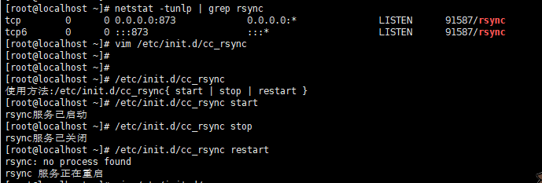

shell函数学习

函数的特点,能简化linux命令,让整个命令更容易读.容易用

将命令组合起来 就成了函数体

然后还需要给函数体起名字 就是函数名

正常使用函数的话 就使用这个函数名 即可

```bash
sayhello(){
  echo "你好 你好"
  echo "你好 你好"
  echo "你好 你好"
  echo "你好 你好"
  echo "你好 你好"
 }
 #直接调动函数 并执行
 sayhello
 增加开发效率

```

给脚本传入参数,检测URL是否正常

普通shell脚本方法

```bash
#!/bin/bash

if [ "$#" -ne 1 ];then
  echo "请输入正确的网址检测"
   exit 1
fi


#利用 wegt 检测url存活性,最大尝试连接次数表1 设定响应超时时间是5 $1代表url参数
wget --spider -q -o /dev/null --tries=1 -T 5 $1

#判断参数值是0 显示 网址正常
 if [ $? -eq 0  ];then
   echo "$1,网站正在运行"
   exit 0

else
#否则 返回参数值1 显示 你网站挂了   
   echo "$1,你网站挂了"
   exit 1
fi
执行效果
[root@localhost test_scripts]# bash check_url.sh www.baidu.com
www.baidu.com,网站正在运行
[root@localhost test_scripts]# bash check_url.sh www.baidu.com1
www.baidu.com1,你网站挂了
[root@localhost test_scripts]# bash check_url.sh 
请输入正确的网址检测


```

用函数的方式

```bash
#!/bin/bash
#定义函数 usage
function usage(){


if [ "$#" -ne 1 ];then
  echo "请输入正确的网址检测"
   exit 1
fi
}
#定义函数 check_url
check_url(){

#利用 wegt 检测url存活性,最大尝试连接次数表1 设定响应超时时间是5 $1代表url参数
wget --spider -q -o /dev/null --tries=1 -T 5 $1

#判断参数值是0 显示 网址正常
 if [ "$?" -eq 0  ];then
   echo "$1,网站正在运行"
   exit 0

else
#否则 返回参数值1 显示 你网站挂了   
   echo "$1,你网站挂了"
   exit 1
fi
}
#将函数接入方法入口 判断如果获取的参数=1 则执行函数usage
main(){
if [ "$#" -ne 1 ]; then
  usage
fi
  check_url $1
}
#调用执行main方法
main $*

执行效果
[root@localhost test_scripts]# bash check_url.sh www.baidu.com
www.baidu.com,网站正在运行
[root@localhost test_scripts]# bash check_url.sh www.baidu.com1
www.baidu.com1,你网站挂了
[root@localhost test_scripts]# bash check_url.sh 
请输入正确的网址检测

```

用函数制作rsync脚本

```bash
#!/bin/bash
#定义使用方法
function usage(){
    echo "使用方法:请输入start|stop|restart,来启动服务"
    exit 0
}

#定义start功能
function start(){
  /usr/bin/rsync --daemon
  sleep 2
if [ `netstat -tunlp | grep rsync |  wc -l` -ge 1 ]; then
   echo " rsync已启动 "
else
   echo "rsync没有启动"
fi
}
#定义stop功能
function stop(){
  killall rsync
  sleep 2
if [ `netstat -tunlp | grep rsync | wc -l` -eq 0 ]; then
   echo "rsync已停止"
else
   echo "rsync没有停止"
fi
}
#定义重启服务
function restart(){
  echo ""
}
#定义函数main 如果start 调用start 如果stop调用stop 如果是restart 先调用stop 再选择start
function main() {
if [ "$#" -ne 1 ]; then
  usage
fi

if [ "$1" = "start" ]; then
  start

elif [ "$1" = "stop" ]; then
  stop

elif [ "$1" = "restart" ]; then
  stop
  sleep 1
  start
else
  usage
fi
}
#调动程序入口函数
main $*

代码运行结果
[root@localhost init.d]# /etc/init.d/funct_rsync.sh start
 rsync已启动 
[root@localhost init.d]# /etc/init.d/funct_rsync.sh stop
rsync已停止
[root@localhost init.d]# /etc/init.d/funct_rsync.sh restart
rsync: no process found
rsync已停止
 rsync已启动 


遇到的问题
中括号表达式中[参数空格问题]
以及写restart函数的时候 又跟普通shell脚本一样 先写杀进程 然后 再写重启 再进行判断 其实可以直接调用stop和start 来实现重启

```
