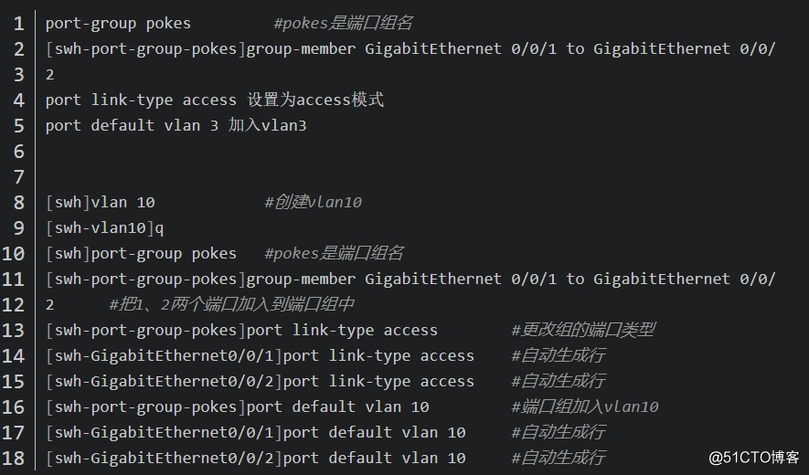
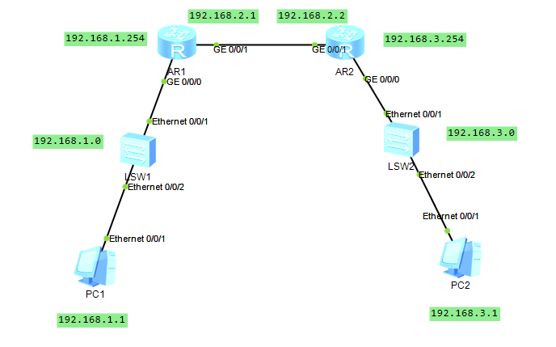
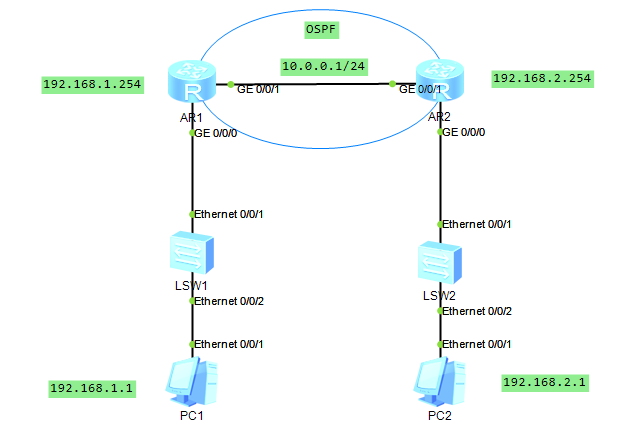
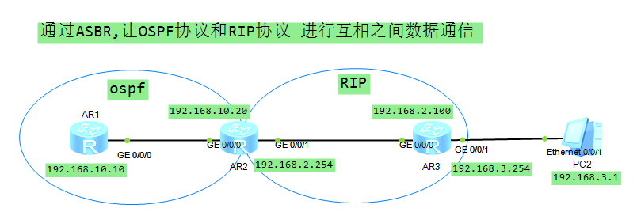
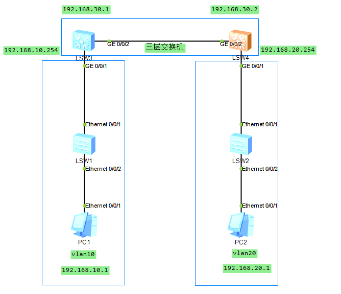
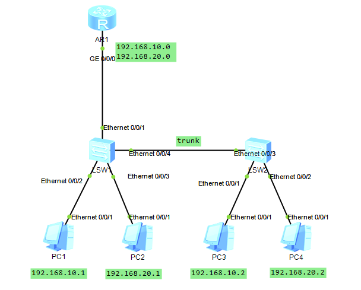
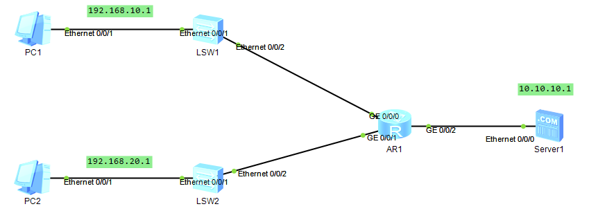
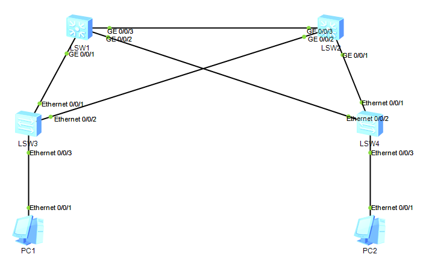
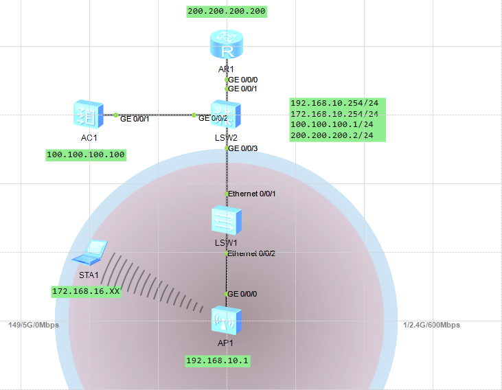
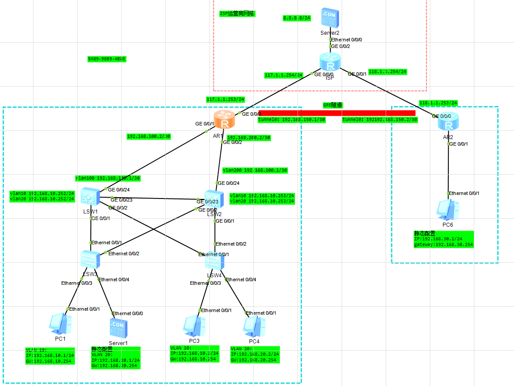

# 华为交换机常用配置命令

### 02 创建VLAN

\<Huawei> //用户视图，一般display命令查看信息比较多。

\<Huawei>system-view //准备进入系统视图。

\[Huawei]vlan 100 //创建vlan 100。

\[Huawei-vlan100]quit //退回系统视图。

### 03 将端口加入到vlan中

\[Huawei] interface GigabitEthernet2/0/1 //(10G光口)

\[Huawei- GigabitEthernet2/0/1] port link-type access //定义端口传输模式

\[Huawei- GigabitEthernet2/0/1] port default vlan 100 //将端口加入vlan100

\[Huawei- GigabitEthernet2/0/1] quit //回到接口视图

\[Huawei] interface GigabitEthernet1/0/0 //进入1号插槽上的第一个千兆网口接口视图中。0代表1号口

\[Huawei- GigabitEthernet1/0/0] port link-type access //定义端口传输模式

\[Huawei- GigabitEthernet2/0/1] port default vlan 10 //将这个端口加入到vlan10中

\[Huawei- GigabitEthernet2/0/1] quit

### 04 将多个端口加入到VLAN中

\<Huawei>system-view

\[Huawei]vlan 10

\[Huawei-vlan10]port GigabitEthernet 1/0/0 to 1/0/29 //将0到29号口加入到vlan10中

\[Huawei-vlan10]quit

### 05 交换机配置IP地址

\[Huawei] interface Vlanif100 // 进入vlan100接口视图与vlan 100命令进入的地方不同

\[Huawei-Vlanif100] ip address 192.168.1.1 255.255.255.0 // 定义vlan100管理IP三层 交换网关路由

\[Huawei-Vlanif100] quit //返回视图

### 06 配置默认网关

\[Huawei]ip route-static 0.0.0.0 0.0.0.0 192.168.1.254 //配置默认网关。

### 07 交换机保存设置和重置命令

\<Huawei>save //保存配置信息

\<Huawei>reset saved-configuration //重置交换机的配置

\<Huawei>reboot //重新启动交换机

### 08 交换机常用的显示命令

**用户视图模式下：**

\<Huawei>display current-configuration //显示现在交换机正在运行的配置明细

\<Huawei>display device //显示各设备状态

\<Huawei>display interface xxx //显示个端口状态，用？可以查看后边跟的选项

\<Huawei>display version //查看交换机固件版本信息

\<Huawei>display vlan xxx // 查看vlan的配置信息

4、端口的批量操作——端口组
原理就是创建一个端口组，把要更改的端口加入到端口组中，然后统一更改类型加入vlan。也可以理解为群组端口，统一配置类型加入vlan.
批量更改，先更改端口类型，再统一加入某个vlan，如下：



华为交换机划vlan 然后添加ip address

创建好vlan以后 然后进入对应的接口
port link-type access
port default vlan X

不同vlan之间互通
接口打好access后 添加默认default vlan xx
然后进入虚拟接口vlanif里面
添加ip address [xxx.xxx.xxx.xxx](http://xxx.xxx.xxx.xxx "xxx.xxx.xxx.xxx") 24 XXX为网关地址
然后就可以实现互通

2台交换机互联的话
第二台交换机 向第一台交换机打trunk
先划好同样的vlan
然后再2台交换机对应的接口上
port link-type trunk
port trunk-allow pass vlan XXXX

dhcp技巧
先开启 dhcp enable
然后ip pool vlan\_10 #以VLAN1\_10为命名地址池
netwook 192.168.XX.XX mask 24
gateway 网关
dnslist 114.114.114.114
dhcp select global #使用全局配置的地址池分配IP地址

删除接口命令undo port link - type

## 静态路由实验

目的互通



```bash
准备工作
PC1 配置 192.168.1.1 255.255.255.0 192.168.1.254

PC2 配置 192.168.3.1 255.255.255.0 192.168.3.254

AR1 接口G0/0/0 配置 192.168.1.254 24

AR1 接口G0/0/1 配置 192.168.2.1 24

AR2 接口G0/0/0 配置 192.168.3.254 24

AR2 接口G0/0/1 配置 192.168.2.2 24

目前pc1 是无法ping通 AR2路由器和PC2电脑的
需要在AR2,AR1中 添加静态路由

[AR2]ip route-static 192.168.1.0 255.255.255.0 192.168.2.1

[AR1]ip route-static 192.168.3.0 255.255.255.0 192.168.2.2

最后进行验证 静态路由成功 PC1 ping通 PC2 实现所有设备互通
PC>ping 192.168.3.1

Ping 192.168.3.1: 32 data bytes, Press Ctrl_C to break
From 192.168.3.1: bytes=32 seq=1 ttl=126 time=78 ms
From 192.168.3.1: bytes=32 seq=2 ttl=126 time=78 ms
From 192.168.3.1: bytes=32 seq=3 ttl=126 time=63 ms

```

## 动态路由实验

动态路由,顾名思义就是动态自己能学习到的,不用静态手动配置和添加



```bash
PC1配置 192.168.1.1 网关192.168.1.254
PC2 配置 192.168.2.1 网关 192.168.2.254

AR1配置

[AR1]ospf
[AR1-ospf-1]area 0
[AR1-ospf-1-area-0.0.0.0]netw  
[AR1-ospf-1-area-0.0.0.0]network 192.168.1.0 0.0.0.255
[AR1-ospf-1-area-0.0.0.0]network 10.0.0.0 0.0.0.255

AR2配置

[AR2]ospf
[AR2-ospf-1]area 0
[AR2-ospf-1-area-0.0.0.0]netw  
[AR2-ospf-1-area-0.0.0.0]network 192.168.2.0 0.0.0.255
[AR2-ospf-1-area-0.0.0.0]network 10.0.0.0 0.0.0.255

PC1 ping通 PC2 

2个路由器里 已学习到OSPF协议 无需配置

AR1 192.168.2.0/24  OSPF    10   2       D   10.0.0.2        GigabitEthernet0/0/1

AR2 192.168.1.0/24  OSPF    10   2       D   10.0.0.1        GigabitEthernet0/0/1

```

## 不同路由之间互相通信实验



```bash
通过ASBR,让OSPF协议和RIP协议 进行互相之间数据通信
左边是OSPF路由协议 右边是RIPversion2协议 默认2者之间是无法通信的首先配置AR1的路由

[ar1]ospf 1

[ar1-ospf-1]ar 0

[ar1-ospf-1-area-0.0.0.0]

[ar1-ospf-1-area-0.0.0.0]netwo  

[ar1-ospf-1-area-0.0.0.0]network 192.168.10.0 0.0.0.255

[ar1-GigabitEthernet0/0/0]ip address 192.168.10.10

再来配置AR2的路由 

首先AR2是做一个中间桥梁作用 需要让ospf协议走过来 也要让RIP协议走过来 能够进行互相通信

先配置左边的OSPF协议

[ar2]ospf 1

[ar2-ospf-1]ar 0

[ar2-ospf-1-area-0.0.0.0]

[ar2-ospf-1-area-0.0.0.0]netwo  

[ar2-ospf-1-area-0.0.0.0]network 192.168.10.0 0.0.0.255

再配置右边RIP协议 以及接口信息

[ar2]rip 1

[ar2-rip-1]version 2

[ar2-rip-1]network 192.168.2.0

xcznamdada.djf netw work sadj1

[ar2-GigabitEthernet0/0/0]ip address 192.168.10.20 24

[ar2-GigabitEthernet0/0/1]ip address 192.168.2.254 24

最后配置AR3的路由

[ar3-GigabitEthernet0/0/0]ip address 192.168.2.100 24

[ar3-GigabitEthernet0/0/1]ip address 192.168.3.254 24

[ar3]rip 1

[ar3-rip-1]version 2

[ar3-rip-1]network 192.168.2.0

[ar3-rip-1]network 192.168.3.0

配置完以后 需要在AR2路由中 将2边的路由协议 互相引导过去

[ar2]ospf 1
[ar2-ospf-1]import  
[ar2-ospf-1]import-route rip 1 co  
[ar2-ospf-1]import-route rip 1 cost 123
[ar2-ospf-1]rip 1
[ar2-rip-1]impor  
[ar2-rip-1]import-route ospf 1 cos  
[ar2-rip-1]import-route ospf 1 cost 3

[ar1]display  ip routing-table 192.168.3.0
Route Flags: R - relay, D - download to fib

---

Routing Table : Public

Summary Count : 1

Destination/Mask    Proto   Pre  Cost      Flags NextHop         Interface

  192.168.3.0/24  O_ASE   150  123         D   192.168.10.20   GigabitEthernet0/0/0

AR1中 已经有了  RIP协议

---

[ar3]display ip routing-table 192.168.10.10
Route Flags: R - relay, D - download to fib

---

Routing Table : Public

Summary Count : 1

Destination/Mask    Proto   Pre  Cost      Flags NextHop         Interface

  192.168.10.0/24  RIP     100  4           D   192.168.2.254   GigabitEthernet0/0/0

AR3中 也有了ospf 协议

AR1 ping 192.168.3.1 正常连通

```

## 不同vlan之间 三层通信



```bash
准备工作
PC1 192.168.10.1 255.255.255.0 192.168.10.254

PC2 192.168.20.1 255.255.255.0 192.168.20.254

lsw3配置

[sw1]vlan batch 10 30
#接口1配置
[sw1]int g0/0/1

[sw1-GigabitEthernet0/0/1]port link-type access 

[sw1-GigabitEthernet0/0/1]port default vlan 10
#vlan 10配置
[sw1]int vlan 10

[sw1-Vlanif10] ip add 192.168.10.254 255.255.255.0
#接口2配置
[sw1]int g0/0/2

[sw1-GigabitEthernet0/0/2]port link-type access 

[sw1-GigabitEthernet0/0/2]port default vlan 30
#vlan 30配置
[sw1]int vlan 30

[sw1-Vlanif30] ip add 192.168.30.1 255.255.255.0

#配置路由协议 三层互通
[sw1]ospf 1
[sw1-ospf-1]area 0
[sw1-ospf-1-area-0.0.0.0]network 0.0.0.0 0.0.0.0


lsw4配置

[sw2]vlan batch 20 30
#接口1配置
[sw2]int g0/0/1

[sw2-GigabitEthernet0/0/1]port link-type access 

[sw2-GigabitEthernet0/0/1]port default vlan 20
#vlan 20配置
[sw2]int vlan 20

[sw2-Vlanif10] ip add 192.168.20.254 255.255.255.0
#接口2配置
[sw2]int g0/0/2

[sw2-GigabitEthernet0/0/2]port link-type access 

[sw2-GigabitEthernet0/0/2]port default vlan 30
#vlan 30配置
[sw2]int vlan 30

[sw2-Vlanif30] ip add 192.168.30.2 255.255.255.0
sancengxieyihutong
#配置路由协议 三层互通
[sw2]ospf 1
[sw2-ospf-1]area 0
[sw2-ospf-1-area-0.0.0.0]network 0.0.0.0 0.0.0.0

pc1 ping 通 pc2 不同之间vlan互通

```

## 单臂路由实验



目的:跨交换机互通

```bash
准备工作
PC1 192.168.10.1 255.255.255.0 192.168.10.254
PC2 192.168.20.1 255.255.255.0 192.168.20.254
PC3 192.168.10.2 255.255.255.0 192.168.10.254
PC4 192.168.20.2 255.255.255.0 192.168.10.254

sw1配置
[sw1]int e0/0/2
[sw1-Ethernet0/0/2]port link-type access
[sw1-Ethernet0/0/2]port default vlan 10
[sw1]int e0/0/3
[sw1-Ethernet0/0/3]port link-type access
[sw1-Ethernet0/0/3]port default vlan 20
[sw1]int e0/0/4
[sw1-Ethernet0/0/4]port link-type trunk
[sw1-Ethernet0/0/4]port trunk allow-pass vlan 10 20
[sw1]int e0/0/1
[sw1-Ethernet0/0/4]port link-type trunk
[sw1-Ethernet0/0/4]port trunk allow-pass vlan 10 20

sw2配置

[sw2]int e0/0/1
[sw2-Ethernet0/0/1]port link-type access
[sw2-Ethernet0/0/1]port default vlan 10
[sw2]int e0/0/2
[sw2-Ethernet0/0/2]port link-type access
[sw2-Ethernet0/0/2]port default vlan 20
[sw1]int e0/0/3
[sw1-Ethernet0/0/3]port link-type trunk
[sw1-Ethernet0/0/3]port trunk allow-pass vlan 10 20

目前2台交换机 只能相同网段进行ping通 无法跨网段通信
PC1 ping 通PC3 PC2 ping 通PC4

AR1配置
#进入路由器的虚拟逻辑接口
[R1]int g0/0/0.1
#划分虚拟接口定义10
[R1-GigabitEthernet0/0/0.1]dot1q termination vid 10
#设置网关地址和掩码
[R1-GigabitEthernet0/0/0.1]ip address 192.168.10.254 255.255.255.0
#开启广播
[R1-GigabitEthernet0/0/0.1]arp broadcast enable 
pc1 成功 ping 通网关192.168.10.254

#进入路由器的虚拟逻辑接口
[R1]int g0/0/0.2
#划分虚拟接口定义20
[R1-GigabitEthernet0/0/0.2]dot1q termination vid 20
#设置网关地址和掩码
[R1-GigabitEthernet0/0/0.2]ip address 192.168.20.254 255.255.255.0

#开启广播
[R1-GigabitEthernet0/0/0.2]arp broadcast enable 
pc2 成功 ping 通网关192.168.20.254

```

## ACL规则实验



```bash
目的 PC1通过规则 无法ping通192.168.20.X 数据和网关
准备工作
PC1 192.168.10.1 255.255.255.0 192.168.10.254
PC2 192.168.20.1 255.255.255.0 192.168.20.254
LSW1 LSW2当傻瓜用不配置
服务器 10.10.10.1 255.255.255.0 10.10.10.254
3
AR1配置
g0/0/0 192.168.10.254 24
g0/0/1 192.168.20.254 24
g0/0/2 10.10.10.254 24
#进入高级规则 (3000以下规则是基础规则)
[R1]acl 3000 
#制定规则5 禁止ip 192.168.10.0的数据通过 192.168.20.0的数据
[R1-acl-adv-3000] rule 5 deny ip source 192.168.10.0 0.0.0.255 destination 192.168.20.0 0.0.0.255
#接口1 应用3000的规则
[R1]int g0/0/0

[R1-GigabitEthernet0/0/0]
[R1-GigabitEthernet0/0/0]traffic-filter inbound acl 3000
目前pc1 无法ping通 192.168.20.254 192.168.20.1 但是可以ping通192.168.10.254和 10.10.10.254 说明规则应用成功

```

## 端口链路聚合实验

可以通过链路聚合强行扩大设备的传输带宽


```bash
用LACP模式进行链路聚合,2条是活动的,1条是备用的 当2条都崩溃的时候,另外1条就可以顶上去备用,现在进行配置

sw1配置
[sw1]int Eth-Trunk 1
#设置lacp的端口聚合模式
[sw1-Eth-Trunk1]mode lacp-static
#进入1,2,3口 配置端口聚合
[sw1]int g0/0/1
[sw1-GigabitEthernet0/0/1]eth-trunk 1
[sw1-GigabitEthernet0/0/1]int g0/0/2
[sw1-GigabitEthernet0/0/2]eth-trunk 1
[sw1-GigabitEthernet0/0/1]int g0/0/3
[sw1-GigabitEthernet0/0/2]eth-trunk 1
#设置优先级(左边为主)
[sw1]lacp priority 100
#进入端口聚合模式,设置最大活动线路2条,1条用作备份
[sw1]int Eth-Trunk 1
[sw1-Eth-Trunk1]max active-linknumber 2
#进入接口1 配置左边1,2接口为主线路
[sw1-Eth-Trunk1]int g0/0/1
[sw1-GigabitEthernet0/0/1]lacp priority 100
[sw1-GigabitEthernet0/0/1]int g0/0/2
[sw1-GigabitEthernet0/0/2]lacp priority 100

sw2配置,基本和sw1一样,
[sw2]int Eth-Trunk 1
[sw2-Eth-Trunk1]mode lacp-static
[sw2]int g0/0/1
[sw2-GigabitEthernet0/0/1]eth-trunk 1
[sw2]int g0/0/2
[sw2-GigabitEthernet0/0/1]eth-trunk 1
[sw2]int g0/0/3
[sw2-GigabitEthernet0/0/1]eth-trunk 1
[sw2]int Eth-Trunk 1
[sw2-Eth-Trunk1]max active-linknumber 2


[sw1]dis eth-trunk 1 显示设备1的端口聚合状态
ActorPortName          Status   PortType PortPri PortNo PortKey PortState Weight
GigabitEthernet0/0/1   Selected 1GE      100     2      305     10111100  1     
GigabitEthernet0/0/2   Selected 1GE      100     3      305     10111100  1     
GigabitEthernet0/0/3   Unselect 1GE      32768   4      305     10100000  1  

1,2接口是活动的 3是备用的
```

## MSTP和负载均衡实验



MSTP是STP的增强型技术，将二层交换机设备端口绑定到不同的进程中，以进程为单位进行生成树计算；不在同一个进程内的端口不参与此进程的MSTP计算，从而让各进程间生成树计算互相独立、互不影响。可以避免线路浪费，做到链路冗余备份，实现负载均衡。

```bash
准备工作
PC1 192.168.10.1 /24 192.168.10.254
PC2 192.168.20.1 /24 192.168.20.254

#2台接入交换机除了3口,其他2个都打trunk
[jsw1]int e0/0/3
[jsw1-Ethernet0/0/3] port link-type access
[jsw1-Ethernet0/0/3] port default vlan 10
[jsw2]int e0/0/3
[jsw2-Ethernet0/0/3] port link-type access
[jsw2-Ethernet0/0/3] port default vlan 20
#批量配置trunk
[jsw1]port-group group-member e0/0/1 to e0/0/2
[jsw1-port-group]port link-type trunk
[jsw1-port-group]port trunk allow-pass vlan all

[jsw2]port-group group-member e0/0/1 to e0/0/2
[jsw2-port-group]port link-type trunk
[jsw2-port-group]port trunk allow-pass vlan all

#批量配置核心交换机 trunk
[coreA]port-group group-member g0/0/1 to g0/0/3
[coreA-port-group]port link-type trunk 
[coreA-port-group]port trunk allow-pass vlan all

[coreB]port-group group-member g0/0/1 to g0/0/3
[coreB-port-group]port link-type trunk 
[coreB-port-group]port trunk allow-pass vlan all

#接入交换机进行MSTP 设置
[jsw1]stp mode mstp
#进行配置
[jsw1]stp region-configuration 
[jsw1-mst-region]region-name mstp
#绑定对应vlan实现负载均衡 然后进行激活
[jsw1-mst-region]instance 1 vlan 10
[jsw1-mst-region]instance 2 vlan 20
[jsw1-mst-region]active region-configuration 
#修订级别 进行同步
[jsw1-mst-region]revision-level 0

#接入交换机进行MSTP 设置
[jsw2]stp mode mstp
#进行配置
[jsw2]stp region-configuration 
[jsw2-mst-region]region-name mstp
#绑定对应vlan实现负载均衡 然后进行激活
[jsw2-mst-region]instance 1 vlan 10
[jsw2-mst-region]instance 2 vlan 20
[jsw2-mst-region]active region-configuration 
#修订级别 进行同步
[jsw2-mst-region]revision-level 0

#核心交换也配置mstp 设置
[coreA]stp mode mstp
#进行配置
[coreA]stp region-configuration 
[coreA-mst-region]region-name mstp
#绑定对应vlan实现负载均衡 然后进行激活
[coreA-mst-region]instance 1 vlan 10
[coreA-mst-region]instance 2 vlan 20
[coreA-mst-region]active region-configuration 
#修订级别 进行同步
[coreA-mst-region]revision-level 0

[coreB]stp mode mstp
#进行配置
[coreB]stp region-configuration 
[coreB-mst-region]region-name mstp
#绑定对应vlan实现负载均衡 然后进行激活
[coreB-mst-region]instance 1 vlan 10
[coreB-mst-region]instance 2 vlan 20
[coreB-mst-region]active region-configuration 
#修订级别 进行同步
[coreB-mst-region]revision-level 0


#最后验证,MSTP有3种状态 MAST代表开启 ALTE代表备用 DESI是指定,等MAST出现故障以后 会从备用端口ALTE那通过
[jsw1]dis stp instance 1 brief 
 MSTID  Port                        Role  STP State     Protection
   1    Ethernet0/0/1               MAST  FORWARDING      NONE
   1    Ethernet0/0/2               ALTE  DISCARDING      NONE
   1    Ethernet0/0/3               DESI  FORWARDING      NONE

```

## wlan组网实验



创建管理vlan及业务vlan

启用DHCP服务（dhcp enable）

为DHCP选择源接口（dhcp select interface）

为capwap隧道绑定管理vlan（capwap source interface vlanif \<vlan-id>）

```bash
#先在AC中进行配置
[AC6005]vlan 100
[AC6005-vlan100]int vlan 100
[AC6005-Vlanif100]ip add  
[AC6005-Vlanif100]ip address 100.100.100.100 24
#进1口 设置trunk模式,和设置静态路由 
[AC6005]int g0/0/1
[AC6005-GigabitEthernet0/0/1]port link-type trunk 
[AC6005-GigabitEthernet0/0/1]port trunk allow-pass vlan all
[AC6005]ip route-static 0.0.0.0 0 100.100.100.1

#配置核心交换机
[core]vlan batch 100 172 192 200
[core]int vlan 100
interface Vlanif100
 ip address 100.100.100.1 255.255.255.0
[core]int vlan 172
 ip address 172.168.10.254 255.255.255.0
 [core]int vlan 192
  ip address 192.168.10.254 255.255.255.0
 [core]int vlan 200
  ip address 200.200.200.1 255.255.255.0
  
  #配置核心交换机g/0/0/2 3口
[core]int g0/0/2
[core]port link-type trunk 
[core]port trunk allow-pass vlan all
[core]int g0/0/3
[core]port link-type trunk 
[core]port trunk allow-pass vlan all

#配置接入交换机
[jsw1]vlan batch 192
[jsw1-Ethernet0/0/2]port link-type access 
[jsw1-Ethernet0/0/2]port default vlan 192

[jsw1]int e0/0/1
[jsw1]port link-type trunk 
[jsw1]port trunk allow-pass vlan all

#互相之间的通信基本完成,现在配置核心交换机 让AP自动获取分配地址
[core]dhcp enable
[core]ip pool fap 
[core-ip-pool-fap]network 192.168.1.0 mask 24
[core-ip-pool-fap]gateway-list 192.168.10.254
[core-ip-pool-fap]option 43 sub-option 2 ip-address 100.100.100.100
[core-vlan192]int vlan 192
[core-Vlanif192]dhcp select global

zhenjibashabixianzaideren

AP 成功获取自动分配地址 192.168.10.253

#为AC上capwap隧道绑定管理vlan
[AC6005]capwap source interface vlanif100
#AC上配置wlan
[AC6005]wlan
#创建SSID模板，并进入模板视图
[AC6005-wlan-view]ssid-profile name ssid-pw
#security-profile命令用来创建安全模板,创建huawei@123密码
[AC6005-wlan-view]security-profile name sec-pw
[AC6005-wlan-sec-prof-sec-pw]security wpa2 psk pass-phrase huawei@123 aes
#创建VAP模板,并通过AC认证的模板下发给AP对应的信息
[AC6005-wlan-view]vap-profile name vap-pw
[AC6005-wlan-vap-prof-vap-pw]forward-mode tunnel
[AC6005-wlan-vap-prof-vap]service-vlan vlan-id 172
[AC6005-wlan-vap-prof-vap]security-profile sec-pw
[AC6005-wlan-vap-prof-vap]ssid-profile ssid-pw
#进入ap组，引用VAP模板、绑定VAP的射频卡
[AC6005-wlan-view]ap-group name group-pw
[AC6005-wlan-ap-group-ap]vap-profile vap wlan 1 radio 0
#将配置好的AP组 放在AP当中 (MAC地址在 dis cur 命令中可以查看)
[AC6005-wlan-view]ap auth-mode mac-auth 00-E0-FC-B3-78-F0 
[AC6005-wlan-ap-0]ap-name ap-pw1
[AC6005-wlan-ap-0]ap-system-profile
[AC6005-wlan-ap-0]ap-group group-pw
#出现提示,加入组以后 会重启AP 选择是
Warning: This operation may cause AP reset. If the country code changes, it will
 clear channel, power and antenna gain configurations of the radio, Whether to c
ontinue? [Y/N]:y

#最后进行核心交换机的 172段的DHCP 自动分配
[core]ip pool fpc
[core-ip-pool-fpc]network 172.168.10.0 mask 24
[core-ip-pool-fpc]gateway-list 172.168.10.254
[core]int vlan172
[core-vlanif172]dhcp select global

最后打开笔记本 输出密码 huawei@123 连接成功~

```

### 综合实验小型企业拓扑搭建



最终业务测试

PC和服务器ping通网关192.168.10.254 192.168.20.254

sw1 sw2 查看mstp状态,VRRP状态,实现负载均衡

sw1 sw2学习 R1下发的路由 学习到192.168.30.0的路由

AR1,AR3,SW1,SW2建立OSPF关系

PC访问互联网 ping通8.8.8.8

```bash
#Jieru_SW_01 配置                                        
batch vlan 10 20

int e0/0/1
port link -type trunk
port trunk allow-pass vlan all

int e0/0/2
port link -type trunk
port trunk allow-pass vlan all

int e0/0/3
port link -type access
port default vlan 10

int e0/0/4
port link -type access
port default vlan 20

#Jieru_SW_02 配置
batch vlan 10 20

int e0/0/1
port link -type trunk
port trunk allow-pass vlan all

int e0/0/2
port link -type trunk
port trunk allow-pass vlan all

int e0/0/3
port link -type access
port default vlan 10

int e0/0/4
port link -type access
port default vlan 20

#核心交换机LSW1配置
batch vlan 10 20 100
#进入STP试图 配置MSTP
stp region-configuration
region-name huawei
instance 1 vlan 10
instance 2 vlan 20
active region-configuration
stp instance 1 root primary
stp instance 2 root secondary
#配置1口,2口,23口,24口
int g0/0/1
port link -type trunk
port trunk allow-pass vlan all
int g0/0/2
port link -type trunk
port trunk allow-pass vlan all

int g0/0/23
port link -type trunk
port trunk allow-pass vlan all
int g0/0/24
port link-type access
port default vlan 100
#开启DHCP分配,ip池
dhcp enable
ip pool vlan10
gateway-list 192.168.10.254
network 192.168.10.0 mask255.255.255.0
ip pool vlan 20
gateway-list 192.168.20.254
network 192.168.20.0 mask255.255.255.0
#进入vlan10 和vlan20 启用全局分配 并配上地址
int vlan10
dhcp select golbal
ip address 192.168.10.252 24
int vlan20
ip address 192.168.20.252 24
dhcp select golbal
int vlan 100
ip address 192.168.100.1 30
#配置ospf路由协议
ospf route id 1.1.1.1
ospf1
ar0
network 192.168.10.0 0.0.0.255
network 192.168.20.0 0.0.0.255
network 192.168.100.0 0.0.0.3


#核心交换机LSW2配置 几乎和lsw1一样,不同的就是主根和次根的区别
vlan batch 10 20 200
stp region-configuration
region-name huawei
instance 1 vlan 10
instance 2 vlan 20
active region-configuration
stp instance 2 root primary
stp instance 1 root secondary
#配置1口,2口,23口,24口
int g0/0/1
port link -type trunk
port trunk allow-pass vlan all
int g0/0/2
port link -type trunk
port trunk allow-pass vlan all

int g0/0/23
port link -type trunk
port trunk allow-pass vlan all
int g0/0/24
port link-type access
port default vlan 200
#开启DHCP分配,ip池
dhcp enable
ip pool vlan10
gateway-list 192.168.10.254
network 192.168.10.0 mask255.255.255.0
ip pool vlan 20
gateway-list 192.168.20.254
network 192.168.20.0 mask255.255.255.0
#进入vlan10 和vlan20 启用全局分配 并配上地址
int vlan10
dhcp select golbal
ip address 192.168.10.253 24
int vlan20
ip address 192.168.20.253 24
dhcp select golbal
#配置ospf路由协议
ospf route id 2.2.2.2
ospf1
ar0
network 192.168.10.0 0.0.0.255
network 192.168.20.0 0.0.0.255
network 192.168.100.0 0.0.0.3

```

```bash
#配置路由器AR1
int g0/0/1
ip address 192.168.100.2 255.255.255.252 
int g0/0/2
ip address 192.168.200.2 255.255.255.252 
#配置ospf路由协议
ospf1
ar0
network 192.168.100.0 0.0.0.3
network 192.168.200.0 0.0.0.3
network 192.168.150.0 0.0.0.3

#添加静态路由和ACL普通规则
ip route-static 0.0.0.0 0 dialer1
acl number 2000 
rule 5 permit source 192.168.0.0 0.0.255.255
#建立隧道链接
int tunnel 0/0/0
tuneel-protocol gre
source dialerl
destination 118.1.1.253
ip address 192.168.150.1 30

#AR2配置
int g0/0/1
ip address 192.168.30.254 255.255.255.0
#创建隧道
int tunnel10/0/0
tunnel-protocol gre
source dialer1
destination 117.1.1.253
ip address 192.168.150.2 30
#建立ospf协议
ospf 1 route-id 4.4.4.4
ar0
network 192.168.30.0 0.0.0.3
network 192.168.150.0 0.0.0.3
#添加路由表
ip static 0.0.0.0 0 dialer 1
#指定acl规则
acl number 2000
rule 5 permit source 192.168.30.0 0.0.0.255

#ISP运营商配置,添加一个拨号用的地址池 
ip pool pppoe1
 gateway-list 117.1.1.254 
 network 117.1.1.0 mask 255.255.255.0 
 ip pool pppoe2
 gateway-list 118.1.1.254 
 network 118.1.1.0 mask 255.255.255.0 
 #进行aaa配置默认认证
 aaa 
 authentication-scheme default
 authorization-scheme default
 accounting-scheme default
 domain default 
 domain default_admin 
 local-user admin password cipher huawei #设置用户及密码
 local-user admin service-type http #设置此用户访问服务
 local-user huawei1 password cipher %$%$0<V`6oiNj2F@(d>=j9~Vk~/7%$%$ #配置PPPOE客户的用户名和密码
 local-user huawei1 service-type ppp #配置用户的接入类型为PPP
 local-user huawei2 password cipher %$%$7yW:Gg]zl$~80b)@oIk@k~/o%$%$ #配置PPPOE客户2的用户名和密码
 local-user huawei2 service-type ppp #配置用户的接入类型为PPP
#配置虚拟口关联地址池1
interface Virtual-Template1
 ppp authentication-mode chap 
 remote address pool pppoe1
 ip address 117.1.1.254 255.255.255.0 
#配置虚拟口关联地址池2
interface Virtual-Template2
 ppp authentication-mode chap 
 remote address pool pppoe2
 ip address 118.1.1.254 255.255.255.0 
#配置接口0,1,2
interface GigabitEthernet0/0/0
 pppoe-server bind Virtual-Template 1
 
interface GigabitEthernet0/0/1
 pppoe-server bind Virtual-Template 2

interface GigabitEthernet0/0/2
 ip address 8.8.8.254 255.255.255.0 
```
