# 群晖备份方案调研

群晖备份方案调研 目前从网上查找资料 结合上家公司同事

总共总结了3套群晖备份方案

## 1.群晖互相之间备份同步

## 准备条件

*   至少要有两台群晖NAS。

*   拥有这两台NAS的管理员账号。

*   都安装了最新版本的Drive Server套件。

确保 备份群晖上有足够的存储空间，毕竟**Hyper Backup是做增量备份**的，如果空间不足，后面可能会导致备份发生异常

在 主群晖 上打开【Hyper Backup】，**选择【远程NAS设备】**

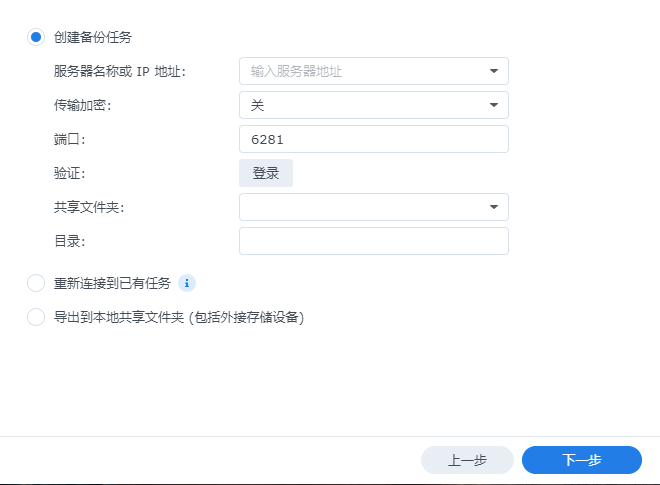

填写备份群晖的地址以及账户 密码 和备份到哪个文件夹

勾选需要备份的数据

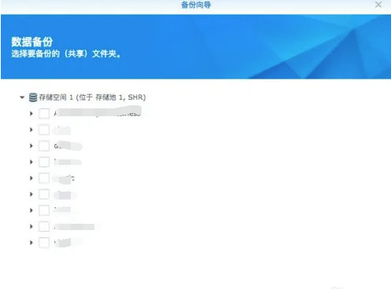

在备份向导中 选择备份时间和备份计划管理

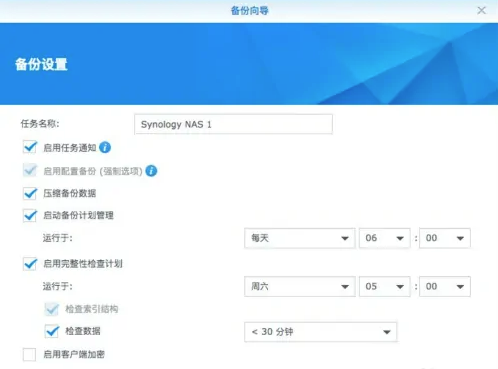

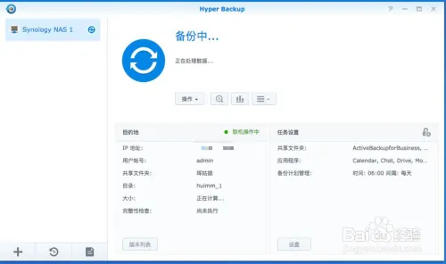

设置完以后就会开始进行备份

**优点:** 群晖之间备份属于增量备份 增量备份的好处就是备份速度快,每次只更改有修改有新增的文件

**缺点:** 需要2台同等硬盘大小的群晖 并且成本较高,并且增量备份对数据恢复角度来说可能比较慢

## 2.备份同步到共享网盘

### 准备条件

*   1台群晖

*   阿里云盘VIP

*   cloud sync，docker套件

打开docker 下载阿里云映像

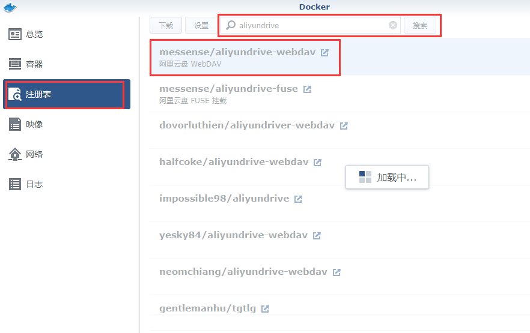

再打开映像中选择高级设置,选择存储空间 测试配置如下

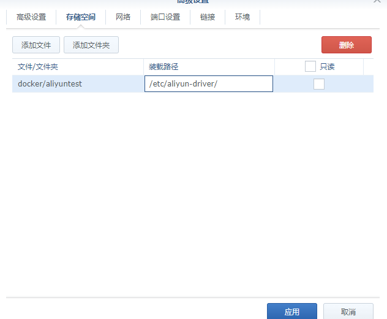

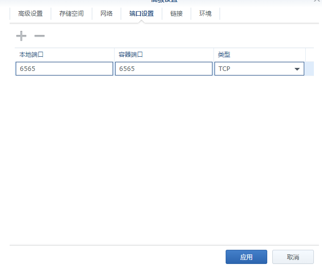

添加端口后

选择配置环境

输入自定义三个变量,期中token的值为阿里云盘的数值

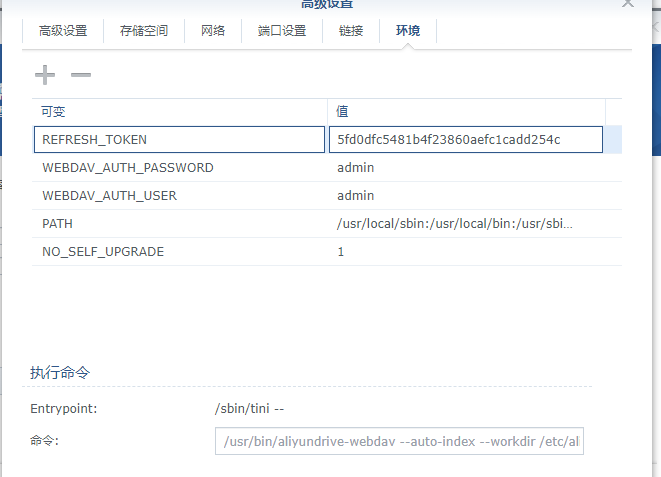

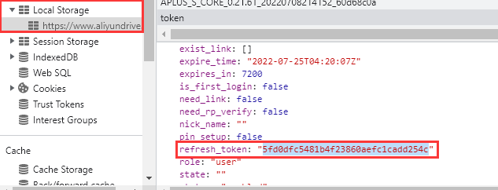

打开对应的cloudsync套件

选择对应的云盘

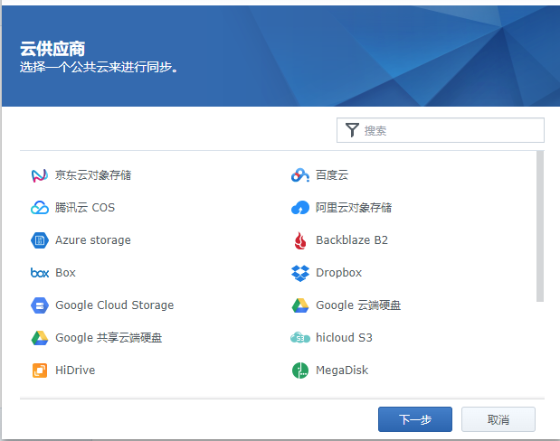

配置服务器地址后选择

本地路径选择想要备份的目录，如我这里选择home根目录备份全部文件

远程路径选择想要备份到阿里云的位置，如我这里在阿里云上创建了个群晖备份文件夹

同步方向可以选双向/仅下载/仅上传，这里可以根据自己的需求选择同步方案

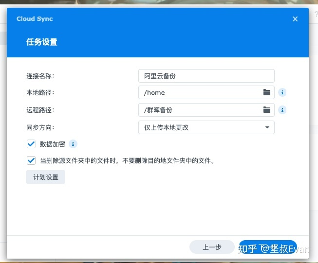

最后点击完成本地文件加密同步到阿里云盘

**优点:** 可以选择实时同步,按计划同步,并且减少运营成本 开通阿里云盘VIP并开通超额容量平均为每年￥388，提供 5TB 容量

**缺点:** 备份的账号或者密码丢失容易造成数据泄露丢失等,云盘最大支持20T空间

## 3.冷备份群晖

### 准备条件

*   1台群晖

*   支持自动休眠的USB3.0的3.5寸硬盘盒，安装硬盘，接入群晖，格式化，作为备份硬盘

*   群晖内安装USB Copy套件，新增备份任务，根据自己的需要，选择镜像、增加等备份方式，选择"插入USB/SD存储设备时

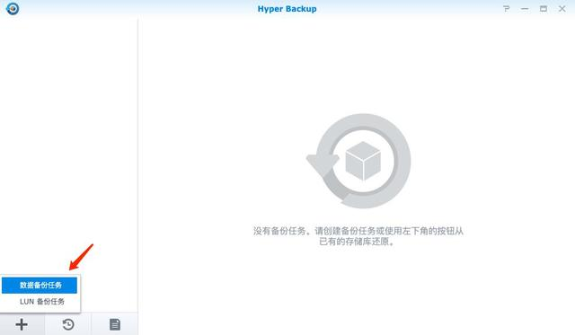

将冷备盘 接入群晖以后 选择hyperbackup 将新建数据备份任务,在弹出的界面中选择本地文件夹和USB

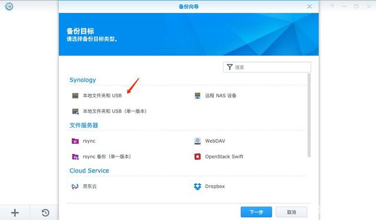

选择数据备份的位置,除了数据以外也可同步进行套件的备份,选择对应的备份时间

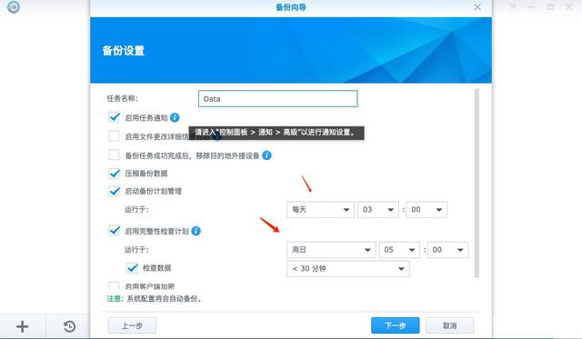

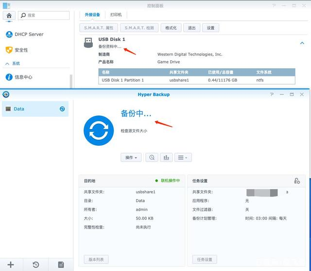

将数据备份好以后可以选择usbcopy同步数据,选择来源文件夹和输出文件夹

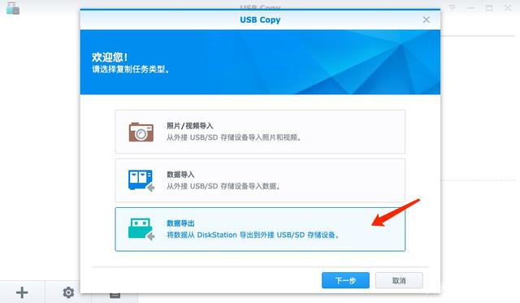

然后选择一下复制模式，下面的说明也很清楚，多版本会在每一次改动都完全复制一遍源文件新建文件夹，镜像基本就是完全一致，源目录删了数据，目的地也同步删，增量就是新版本会覆盖旧版本，但是删了数据不会在目的地也删除

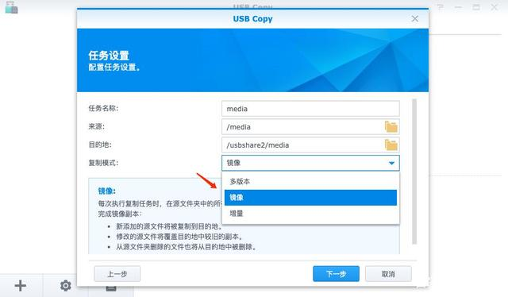

最后配置计划需求 按时进行备份

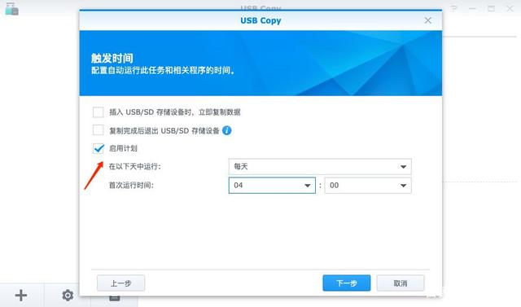

**优点:** 是非常快速的备份方法（只需拷贝文件）容易恢复到某个时间点上（只需将文件再拷贝回去）

**缺点:** 若磁盘空间有限，只能拷贝到磁带等其它外部存储设备上，速度会很慢，不能按表或按用户恢复

整体总结：预算有限的情况下考虑冷备份自由度高，可组成磁盘空间大满足需求，因为阿里云盘最大只支持20T的空间。在预算充足的情况下考虑2台群晖备份同步，数据安全性高，数据稳定 备份速度快
